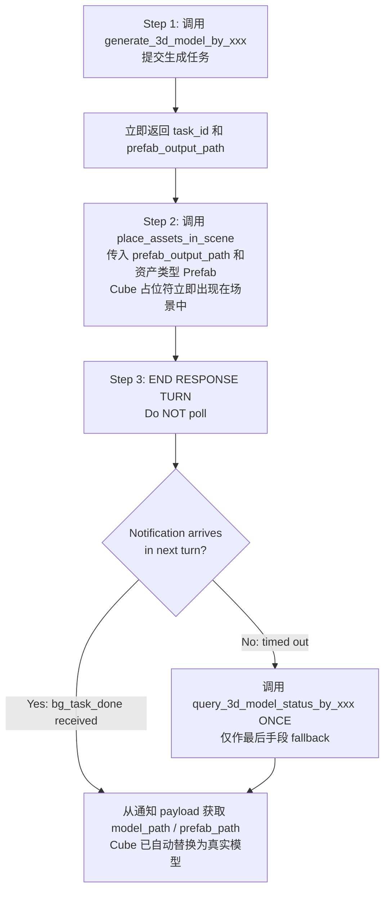

# 3D 模型生成

## 模型选择规则

| 场景 | 选择 | 工具前缀 | 子文档 |
|------|------|----------|--------|
| 默认/通用/低面/小游戏/移动端 | Tripo P1 | `generate_3d_model_by_tripo_p1` | 读 `generators/tripo-p1.md` |
| 高精度/hero资产/PBR/FBX | Hunyuan 3.1 | `generate_3d_model_by_tencent_generation` | 读 `generators/tencent-generation.md` |

## ⚠️ 调用前必须读对应子文档

在调用任何工具前，先用 Read 读取对应模型的 `.md` 文件，获取完整参数说明和约束。

## ⚡ CRITICAL: Async Workflow — Notification-Driven, No Polling

- **生成耗时 3–15 分钟，工具调用立即返回。**
- **🚫 POLLING IS STRICTLY FORBIDDEN.** Never call `query_3d_model_status_by_*` in a loop or more than once.
  - ❌ Do NOT call query tools repeatedly
  - ❌ Do NOT loop or wait for status
  - ✅ Apply the placeholder immediately, then **end your response turn**
  - ✅ A `<bg_task_done>` notification arrives **automatically** in your next turn with all results
  - ✅ Use `query_3d_model_status_by_*` **at most once**, only as a last-resort fallback if no notification arrives
- When `session_id=""` in a notification, it came from domain reload recovery — match by `task_id` or `backend_task_id` instead.

## 标准工作流

## 通用异步说明

生成耗时 3–15 分钟，工具调用立即返回，不阻塞。  
domain reload 发生时任务自动恢复，状态显示 `"recovering"`。

## `<bg_task_done>` Notification (Primary)

When generation completes, a `<bg_task_done>` notification is automatically injected into your next turn:

| Field | Description |
|-------|-------------|
| `status` | `"completed"` or `"failed"` |
| `model_path` | Final 3D model asset path |
| `prefab_path` | Prefab asset path |
| `preview_url` | Preview URL or local file path |
| `generator_type` | Generator used (e.g. `"tripo-p1"`, `"tencent-generation"`) |
| `prompt` | Original prompt |
| `image_path` | Original image path (if used) |
| `progress` | `100` when completed |
| `start_time` | Generation start timestamp |
| `end_time` | Generation end timestamp |
| `duration_seconds` | Total generation time |
| `error` | Error message (when `failed`) |

**If you receive this notification, the task is done. Do NOT call `query_3d_model_status_by_*`.**
