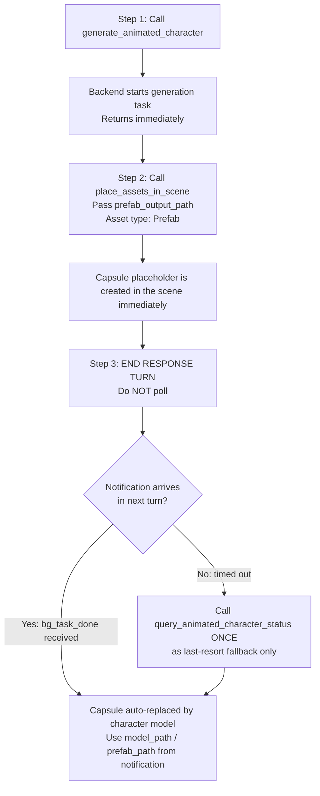

# Generate Animated Humanoid Character in Unity 🏃

Generate rigged **humanoid** 3D characters with animations in Unity using Meshy AI, from text prompts.

**Output:**
- Up to 4 FBX files (character + animations)
- Fully configured Animator + AnimatorController (Idle / Walk / Run / Action)

> **Humanoid-only:** This tool generates bipedal human-skeleton characters only. For generic 3D objects (weapons, furniture, vehicles), use a different 3D generation tool.


## When NOT to Use

- User wants a generic 3D object (weapon, prop, vehicle) — use a 3D model generation tool
- User wants a skybox — use `unity-skybox-generation`
- User wants a 2D sprite — use `unity-sprite-generation`


## ⚡ CRITICAL: Async Workflow — Notification-Driven, No Polling

- **This API is fully asynchronous with maximum 3 active generation tasks — generation takes 3–10 minutes. DO NOT block!**
- `generate_animated_character` returns immediately with a `task_id` and `prefab_output_path`.
- **🚫 POLLING IS STRICTLY FORBIDDEN.** Never call `query_animated_character_status` in a loop or more than once.
  - ❌ Do NOT call `query_animated_character_status` repeatedly
  - ❌ Do NOT loop or wait for status
  - ✅ Apply the placeholder immediately, then **end your response turn**
  - ✅ A `<bg_task_done>` notification arrives **automatically** in your next turn with all results
  - ✅ Use `query_animated_character_status` **at most once**, only as a last-resort fallback if no notification arrives
- When `session_id=""` in a notification, it came from domain reload recovery — match by `task_id` or `backend_task_id` instead.

- Immediately call `place_assets_in_scene` skill with `prefab_output_path` and asset type `Prefab` to instantiate the prefab in the scene. A Capsule placeholder will appear right away.

- When generation completes, the Capsule is **automatically replaced** by the real model; Animator + AnimatorController are auto-assigned — no manual post-processing required.


## ℹ️ Domain Reload Is Transparent

- Generation runs on the backend — a domain reload in Unity does not affect the server task.
- Task state is persisted to `Library/AI.TJGenerators/InterruptedTasks.json` on reload.
- After a domain reload, the task resumes automatically. When queried again, return the current status (e.g., `"generating"`), and it may temporarily appear as `"recovering"` during restoration.
- Only use `execute_csharp_script` for C# scene work; do NOT write `.cs` files to disk.

---

## **Recommended workflow:**



The only unrecoverable case is `"interrupted"` (rare): backend task record was lost.  
Call `generate_animated_character` again with `force_overwrite=true`.

---

## Tools

All tools are called via `execute_custom_tool`.

### `generate_animated_character`

Start a humanoid animated character generation task.

```python
execute_custom_tool(
  tool_name="generate_animated_character",
  parameters={
    "prompt": "a medieval knight in full plate armor",
    "prefab_output_path": "Assets/Characters/Knight",
    "force_overwrite": False,
    "action_id": 452,
    "target_polycount": 15000,
    "pose_mode": "t-pose",
    "height_meters": 1.7,
    "enable_pbr": True,
    "topology": "quad",
    "should_remesh": True,
    "symmetry_mode": "auto",
    "seed": 0
  }
)
````

**Required:** `prompt` (max 600 chars)

**Optional parameters:**

| Parameter | Type | Default | Description |
|-----------|------|---------|-------------|
| `prefab_output_path` | string | `Assets/TJGenerators/History/` | Save path for the generated prefab. Auto-deduplicated if path already exists. |
| `action_id` | int | 452 (Backflip) | Animation action to generate; see Animation Action IDs table |
| `target_polycount` | int | 30,000 | Target polygon count (100–300,000). Actual count may vary by geometry complexity. Only effective when `should_remesh=true`. |
| `pose_mode` | string | `"t-pose"` | Pose mode: `"t-pose"`, `"a-pose"`, or `""` (no specific pose) |
| `height_meters` | float | 1.7 | Character height in meters |
| `enable_pbr` | bool | `true` | Generate PBR textures (metalness, roughness, normal map + albedo) |
| `should_remesh` | bool | `true` | Enable remesh stage. When `false`, returns highest-resolution triangle mesh directly. |
| `topology` | string | `"triangle"` | Mesh topology: `"quad"` (quad-dominant) or `"triangle"` (simplified). Only effective when `should_remesh=true`. |
| `symmetry_mode` | string | `"auto"` | Symmetry: `"off"` (none), `"auto"` (detect from input geometry), `"on"` (force) |
| `seed` | int | 0 (random) | Random seed. `0` = random each time |
| `force_overwrite` | bool | `false` | Delete existing prefab at path and regenerate |

**Returns:**

* `task_id`
* `prefab_output_path` (placeholder prefab path — available immediately)
* `estimated_wait_seconds` (~300)
* `notification_mode`: `"bg_task_done"` — confirms automatic notification is supported

**Returns on submission failure:**
```json
{ "success": false, "error_code": "AUTH_REQUIRED", "message": "Not logged in. Open Window → Unity Connect and sign in." }
```
Check `result["success"]` before reading `task_id`. If `false`, report the error immediately and do NOT poll.

#### Animation Action IDs

Use `action_id` to specify the custom animation.

| ID | Name | Category |
|----|------|----------|
| 0 | Idle | Daily |
| 42 | Casual_Walk | Walk |
| 26 | Run_02 | Run |
| 4 | Attack | Combat |
| 75 | Arm_Circle_Shuffle | Dance |
| **452** | **Backflip (default)** | Stunt |

Full list (676 entries): see `animations.json` (in the same directory as this SKILL.md)


### `<bg_task_done>` Notification (Primary)

When generation completes, a `<bg_task_done>` notification is automatically injected into your next turn:

| Field | Description |
|-------|-------------|
| `status` | `"completed"` or `"failed"` |
| `model_path` | Final model asset path |
| `prefab_path` | Prefab asset path |
| `preview_url` | Preview URL or local file path |
| `generator_id` | Generator used |
| `prompt` | Original prompt |
| `progress` | `100` when completed |
| `start_time` | Generation start timestamp |
| `end_time` | Generation end timestamp |
| `duration_seconds` | Total generation time |
| `error` | Error message (when `failed`) |

**If you receive this notification, the task is done. Do NOT call `query_animated_character_status`.**

> `session_id` is empty string when notification comes from domain reload recovery path — match by `task_id` or `backend_task_id` instead.

### `query_animated_character_status` — Fallback Only, Do NOT Poll

> ⚠️ **This tool is a last-resort fallback.** Only call it ONCE if no `<bg_task_done>` notification arrives after the estimated wait time. Never call it in a loop.

```python
execute_custom_tool(
  tool_name="query_animated_character_status",
  parameters={"task_id": "animated_character_1_638..."}
)
```

**Returns:** Same fields as the `<bg_task_done>` notification payload above, plus:

* `animation_path` (when available)
* `walking_animation_path` (when available)
* `running_animation_path` (when available)
* `files` (array of `{path, type, description}` — only when `completed`)
* `result_summary` (only when `completed`)
* `hint`


#### Status meanings

| Status       | Meaning                                               | Action       |
| ------------ | ----------------------------------------------------- | ------------ |
| initializing | Task created                                          | Inform user |
| generating   | Backend generating OR local download in progress      | Inform user |
| recovering   | Domain reload happened, resuming                      | Inform user |
| completed    | Model + animations downloaded and ready               | Read files   |
| failed       | Backend error                                         | Check error  |
| interrupted  | Backend record lost                                   | Re-generate  |

> **⚠️ `generating` at 100% progress ≠ done!**
> When `status="generating"` AND `progress=100`, the backend has finished but model files are
> still **downloading and importing locally** (can take 1–3 minutes).
> Only `status="completed"` means the files are ready.

### `list_animated_character_tasks`

List all tasks.

```python
execute_custom_tool(
  tool_name="list_animated_character_tasks",
  parameters={}
)
```

**Returns**

```
{ success: true, count: N, tasks: [...] }
```

Each entry in `tasks` includes the same fields as `query_animated_character_status`; conditional fields (`files`, `result_summary`, `next_poll_recommended_after_seconds`, `polling_hint`) are only present when applicable.

---

## Usage Examples

### Single Character

```python
result = execute_custom_tool(
    tool_name="generate_animated_character",
    parameters={
        "prompt": "a fantasy warrior with sword and shield",
        "prefab_output_path": "Assets/Characters/Warrior",
        "action_id": 4,            # Attack — see Animation Action IDs table
        "target_polycount": 15000,
        "enable_pbr": True,
        "topology": "quad",
        "should_remesh": True,
    }
)
if not result.get("success", True):
    raise RuntimeError(f"[{result['error_code']}] {result['message']}")
task_id = result["task_id"]
prefab_path = result["prefab_output_path"]
# → Immediately call place_assets_in_scene with prefab_path, asset type Prefab
# → Then end response turn — bg_task_done notification arrives automatically. Do NOT poll.
```

### Parallel — Multiple Characters at Once (max 3)

Submissions run in parallel to eliminate HTTP round-trip latency. Each prefab is placed in the scene as soon as its submission returns.

```python
from concurrent.futures import ThreadPoolExecutor, as_completed

def create_character(params):
    result = execute_custom_tool(
        tool_name="generate_animated_character",
        parameters=params
    )
    if not result.get("success", True):
        raise RuntimeError(f"[{result['error_code']}] {result['message']}")
    return result["task_id"], result["prefab_output_path"]

params_list = [
    {
        "prompt": "a medieval knight in full plate armor",
        "prefab_output_path": "Assets/Characters/Knight",
        "action_id": 452,
        "target_polycount": 15000,
        "enable_pbr": True,
        "topology": "quad",
        "should_remesh": True,
    },
    {
        "prompt": "a sci-fi soldier in combat gear",
        "prefab_output_path": "Assets/Characters/Soldier",
        "action_id": 75,
        "target_polycount": 12000,
        "enable_pbr": True,
        "topology": "quad",
        "should_remesh": True,
    }
]

task_ids = []

with ThreadPoolExecutor(max_workers=3) as executor:
    futures = [executor.submit(create_character, p) for p in params_list]
    for future in as_completed(futures):
        task_id, prefab_path = future.result()
        task_ids.append(task_id)
        # → Immediately call place_assets_in_scene with prefab_path, asset type Prefab
        # → Then end response turn — bg_task_done notification arrives automatically
```

Do NOT poll proactively. The `<bg_task_done>` notification arrives automatically when done.
If no notification arrives, call `query_animated_character_status` **once** as fallback only.
Instruct the user to observe the scene for the Capsule being automatically replaced by the final character model.

---

## Controlling Animations

### AnimatorController States

Four states are auto-created:

| State | Clip | Transition Condition |
|-------|------|----------------------|
| Idle | Walk clip (reused to avoid T-pose); T-pose only when no clips exist | Fallback default |
| Walk | Walking loop clip | `Speed > 0.1` |
| Run | Running loop clip | `Speed > 0.5` |
| Action | Custom action clip (`action_id`) | `Action` trigger |

**Default state** is determined by available clips (in order):
1. **Action** — when action clip exists: plays immediately on entering Play Mode
2. **Walk** — when no action clip but walk clip exists: loops walk immediately on entering Play Mode
3. **Idle** — fallback when no clips available: T-pose

Parameters:

```
Speed (Float)
Action (Trigger)
```

> 生成完成后点 Play，会自动播放用户请求的动作（backflip/dance 等）；动作结束后（exitTime 90%）自动衔接 Walk 循环（如有），不会出现 T-pose。

### ⚠️ Prefer `execute_csharp_script` — No MonoBehaviour Needed for Most Cases

The AnimatorController is fully configured after generation. You can control animation playback by modifying the **AnimatorController asset** via `execute_csharp_script` — no `.cs` file, no domain reload.

### Quick Decision Guide

| Goal | Approach | Needs MonoBehaviour? |
|------|----------|----------------------|
| Action (backflip/dance/etc.) plays on entering Play Mode | **自动**，无需任何操作 | ❌ |
| Walk loops on entering Play Mode (override Action default) | Change default state to `Walk` | ❌ |
| Restore Action as default (after manual change) | Change default state to `Action` | ❌ |
| Press a key to trigger Action at runtime | MonoBehaviour reads `Input` → `SetTrigger` | ✅ |
| WASD movement control at runtime | MonoBehaviour reads `Input` → `SetFloat("Speed", ...)` | ✅ |

> **Note on MonoBehaviour:** If runtime input control is needed, that is gameplay programming (outside the generator's scope). Always use `execute_csharp_script` — do NOT write a `.cs` file to disk, as it triggers domain reload and disrupts in-memory task state.

---

## Troubleshooting

| Issue | Fix |
|-------|-----|
| Cannot find generator config | Install package `cn.tuanjie.ai.generators` |
| Status shows "recovering" | Domain reload occurred — inform user; query once more only if they ask |
| Status shows "interrupted" | Re-call generate_animated_character with `force_overwrite=true` |
| Animations not playing | Verify FBX Animation Type = Humanoid; Animator assigned |
| Character stuck in T-pose | Check Idle default state exists; Speed parameter is being set |
