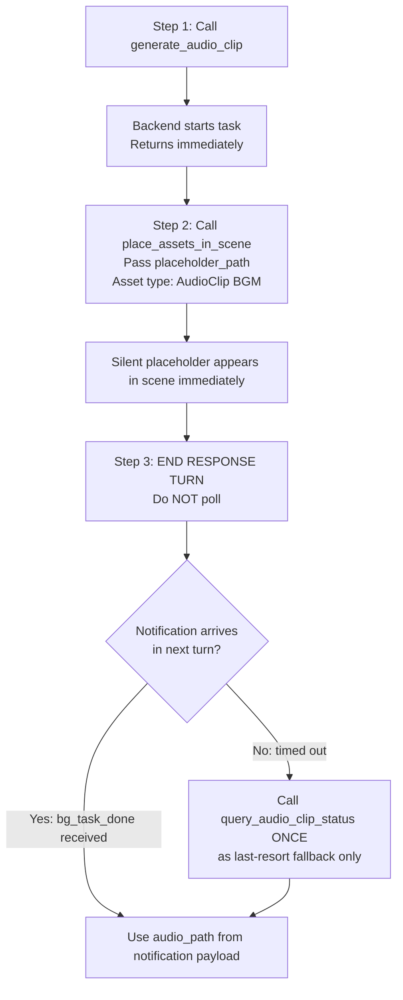

# Generate Audio Clip (BGM / Ambient Music) in Unity 🎵

Generate **background music and ambient audio** assets in Unity using Huoshan Music AI, from text descriptions of music style, mood, or scene.
Output: WAV file auto-imported as **AudioClip**, saved to `Assets/TJGenerators/History/`.

> **⚠️ BGM and ambient sound only.** This tool generates looping music tracks, not one-shot sound effects (SFX). For sound effects (gunshots, footsteps, UI clicks, explosions, etc.), use the **`generate_sound_effect`** skill instead.

## When NOT to Use
- **User wants sound effects (SFX)** — gunshots, footsteps, UI clicks, explosions, item pickups, etc. → Use the **`generate_sound_effect`** skill instead. Do NOT use this skill for SFX.
- User wants to edit or mix existing audio files (this tool only generates new audio)

## ⚡ CRITICAL: Async Workflow — Notification-Driven, No Polling

- **This API is fully asynchronous (~60–180 seconds). DO NOT block!**
- `generate_audio_clip` returns immediately with `task_id` and `placeholder_path`.
- **🚫 POLLING IS STRICTLY FORBIDDEN.** Never call `query_audio_clip_status` in a loop or more than once.
  - ❌ Do NOT call `query_audio_clip_status` repeatedly
  - ❌ Do NOT loop or wait for status
  - ✅ Apply the placeholder immediately, then **end your response turn**
  - ✅ A `<bg_task_done>` notification arrives **automatically** in your next turn with all results
  - ✅ Use `query_audio_clip_status` **at most once**, only as a last-resort fallback if no notification arrives
- Immediately call `place_assets_in_scene` with `placeholder_path` and asset type `AudioClip BGM`. A silent placeholder WAV appears right away.
- When generation completes, the WAV is **overwritten in-place** — no rebinding needed.

## **Recommended workflow:**



## Tools

All tools are called via `execute_custom_tool`.

### `generate_audio_clip`
Start an audio clip generation task.

```python
execute_custom_tool(
  tool_name="generate_audio_clip",
  parameters={
    "prompt": "epic orchestral battle music, intense drums, rising tension",  # Required
    "generator_id": "huoshan_music",      # Only available generator (default)
    "duration": 60,                       # Optional: int, seconds, range 30-120, default 60
    "enable_input_rewrite": True,        # Optional: bool, let AI rewrite your prompt
    "play_on_awake": True,               # Optional: bool, whether AudioSource auto-plays on Play Mode start, default True
    # output_path: NOT recommended. Default saves to Assets/TJGenerators/History/ which is correct.
    # Only specify output_path if user explicitly requests a custom save location.
  }
)
```

> **⚠️ Do NOT specify `output_path` unless the user explicitly requests it.** The default save path `Assets/TJGenerators/History/` is the standard location for all generated assets. Using a custom path (e.g. `Assets/Audio/BGM`) with a folder that doesn't exist in the project can cause the asset to not be imported into Unity correctly.

**Required:** `prompt` — describe the music style, mood, instruments, or scene
**Returns:**
- `task_id`: Identifier for polling
- `placeholder_path`: WAV placeholder asset path — **available immediately**, assign to AudioSource right away
- `estimated_wait_seconds`: ~90 seconds
- `notification_mode`: `"bg_task_done"` — confirms automatic notification is supported

**Returns on submission failure:**
```json
{ "success": false, "error_code": "AUTH_REQUIRED", "message": "Not logged in. Open Window → Unity Connect and sign in." }
```
Check `result["success"]` before reading `task_id`. If `false`, report the error immediately and do NOT poll.

> **Placeholder workflow:** `placeholder_path` is a minimal silent WAV asset created at the start. Call `place_assets_in_scene` right away with asset type `AudioClip BGM`. When generation completes, the file is overwritten in-place — no rebinding needed. Use `query_audio_clip_status` to check when `audio_path` is ready.

#### Parameters

| Parameter | Type | Default | Description |
|-----------|------|---------|-------------|
| `generator_id` | string | `"huoshan_music"` | Generator to use; only `"huoshan_music"` is available |
| `prompt` | string | **required** | Music style, mood, instruments, or scene description |
| `duration` | int | `60` | Output length in seconds (range: 30–120). Can also be specified in the prompt itself (e.g., "30-second intro track") |
| `enable_input_rewrite` | bool | `true` | Let the AI rephrase your prompt for better results |
| `play_on_awake` | bool | `true` | Whether the BGM AudioSource plays automatically when entering Play Mode. Set to `false` if you want to trigger playback via script |
| `output_path` | string | — | Custom save path; omit to use default |

### `<bg_task_done>` Notification (Primary)

When generation completes, a `<bg_task_done>` notification is automatically injected into your next turn. Its payload contains **all the same fields as `query_audio_clip_status`**:

| Field | Description |
|-------|-------------|
| `status` | `"completed"` or `"failed"` |
| `audio_path` | Final AudioClip asset path |
| `preview_url` | Audio preview URL or local file path |
| `generator_id` | Generator used |
| `prompt` | Original prompt |
| `progress` | `100` when completed |
| `start_time` | Generation start timestamp |
| `end_time` | Generation end timestamp |
| `duration_seconds` | Total generation time |
| `error` | Error message (when `failed`) |

**If you receive this notification, the task is done. Do NOT call `query_audio_clip_status`.**

> `session_id` is empty string when notification comes from domain reload recovery path — match by `task_id` or `backend_task_id` instead.

### `query_audio_clip_status` — Fallback Only, Do NOT Poll

> ⚠️ **This tool is a last-resort fallback.** Only call it ONCE if no `<bg_task_done>` notification arrives after the estimated wait time. Never call it in a loop.

```python
execute_custom_tool(
  tool_name="query_audio_clip_status",
  parameters={"task_id": "audio_1_638..."}
)
```

**Returns:** Same fields as the `<bg_task_done>` notification payload above, plus:
- `placeholder_path`: WAV placeholder path *(only present when `generating`)*

### `list_audio_clip_tasks`
List all active and recent audio tasks.

```python
execute_custom_tool(
  tool_name="list_audio_clip_tasks",
  parameters={}
)
```

**Returns:** `{ success: true, count: N, tasks: [...] }` — each entry in `tasks` includes the same fields as `query_audio_clip_status`; conditional fields are only present when applicable.

## Usage Examples

### Generate Background Music
```python
result = execute_custom_tool(
    tool_name="generate_audio_clip",
    parameters={
        "prompt": "calm ambient fantasy RPG town music, gentle flute and strings, peaceful atmosphere",
        "duration": 60
    }
)
if not result.get("success", True):
    raise RuntimeError(f"[{result['error_code']}] {result['message']}")
task_id = result["task_id"]
placeholder_path = result["placeholder_path"]  # WAV available immediately
# → {"success": true, "task_id": "audio_1_...",
#    "placeholder_path": "Assets/TJGenerators/History/Music_20260304_120000.wav"}

# Assign BGM AudioSource: use place_assets_in_scene skill with asset type AudioClip BGM
# Then end response turn — bg_task_done notification arrives automatically. Do NOT poll.
```

## Prompt Writing Guide

Write prompts that describe **style, mood, instruments, and scene** — think of it as briefing a composer:

| Scene | Example Prompt |
|-------|----------------|
| RPG town | `"peaceful medieval town music, acoustic guitar, flute, warm and welcoming"` |
| Boss fight | `"intense orchestral battle, heavy brass, fast percussion, rising tension"` |
| Exploration | `"ambient open world exploration, soft synth pads, gentle piano, sense of wonder"` |
| Horror | `"unsettling horror ambiance, dissonant strings, low rumbles, eerie silence"` |
| Victory | `"triumphant fanfare, full orchestra, brass stabs, heroic and celebratory"` |
| Sci-fi | `"futuristic electronic ambient, pulsing synths, glitchy textures, space atmosphere"` |
| Casual/mobile | `"upbeat cheerful casual game music, ukulele, xylophone, light and fun"` |

**Tips:**
- Name the **genre or style**: orchestral, electronic, jazz, folk, metal
- Describe the **mood**: peaceful, tense, mysterious, heroic, melancholic
- Mention **instruments**: piano, guitar, strings, synth, drums
- Describe the **energy**: calm, slow build, driving, intense
- Mention **use case**: background loop, intro jingle, boss fight, menu theme

## Troubleshooting

### "Cannot find music generator config for 'huoshan_music'"
The TJGenerators package is not installed or the config hasn't loaded. Check:
- `cn.tuanjie.ai.generators` is in `Packages/manifest.json`
- Unity Editor has finished compiling

### Task lost after domain reload (task_id no longer valid)
Task state is normally auto-managed. Prefer `execute_csharp_script` or `place_assets_in_scene`; unless explicitly requested, do not write `.cs` files to disk.

### Task stuck in "generating"
- Normal generation time is 60–180 seconds depending on duration
- Longer `duration` values take more time
- Check internet connection
- Use `list_audio_clip_tasks` to verify the task exists

### Audio sounds wrong or doesn't match prompt
- Be more specific about instruments and mood
- Try `enable_input_rewrite: true` for better prompt interpretation
- Shorten or simplify the prompt — avoid contradictory descriptions
- Lower `duration` for faster iteration while testing prompts

### AudioClip import issues in Unity
- Right-click the asset in the Project window → Reimport
- Check that the .wav file exists at `audio_path`
