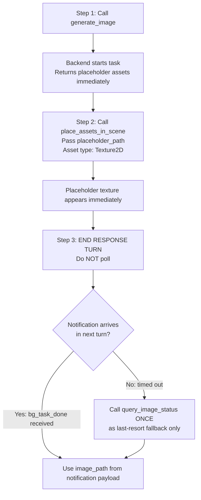

# Generate Image Asset in Unity 🖼️

Generate image assets (Texture2D, PNG) in Unity using AI, from text prompts or reference images.
Output: PNG imported as **Texture2D (Default type)**, auto-saved to `Assets/TJGenerators/History/`.

Supports two models:
- **火山 SeeDream** (`huoshan_seedream_image`, default) — General-purpose text/image-to-image, with size selection and auto background removal
- **Frontier** (`frontier-effect`) — Stylized effect generation; supports `resolution` (0.5K/1K/2K/4K), `aspect_ratio`, and `output_format` (png/jpeg)

## ⚡ CRITICAL: Async Workflow — Notification-Driven, No Polling

- **This API is fully asynchronous (~30–90 seconds). DO NOT block!**
- `generate_image` returns immediately with `task_id` and `placeholder_path`.
- **🚫 POLLING IS STRICTLY FORBIDDEN.** Never call `query_image_status` in a loop or more than once.
  - ❌ Do NOT call `query_image_status` repeatedly
  - ❌ Do NOT loop or wait for status
  - ✅ Apply the placeholder immediately, then **end your response turn**
  - ✅ A `<bg_task_done>` notification arrives **automatically** in your next turn with all results
  - ✅ Use `query_image_status` **at most once**, only as a last-resort fallback if no notification arrives

## Recommended Workflow



**Key Points:**
- `generate_image` returns immediately with a `task_id` **and a usable `placeholder_path`**
- The placeholder (1×1 gray PNG) is available immediately — pass it to `place_assets_in_scene` with asset type `Texture2D`
- Generation runs in background (~30–90 seconds); placeholder auto-replaced when done
- **Maximum 5 concurrent tasks** — do not start more than 5 at once
- When `session_id=""` in a notification, it came from domain reload recovery — match by `task_id` or `backend_task_id` instead

## When to Use
- User wants to generate a general-purpose image, texture, concept art, or background
- User says "生成图片", "AI画图", "生成贴图", "make an image", "generate a texture", "concept art"
- User wants a reference image for a material, UI background, poster, or banner
- User wants an artistic effect applied to an existing image (Frontier model)

## When NOT to Use
- User wants a game **sprite** with transparent background (icon, item, character portrait) → use `unity-sprite-generation` skill
- User wants a **skybox** → use `unity-skybox-generation` skill
- User wants **background music or sound** → use `unity-audio-clip-generation` skill
- User wants a **3D model** → use `unity-3d-generation` skill

## Tools

All tools are called via `execute_custom_tool`.

### generate_image
Start an image generation task.

```bash
execute_custom_tool(
  tool_name="generate_image",
  parameters={
    "prompt": "a serene mountain lake at sunset, photorealistic",  # Text description
    "generator_id": "huoshan_seedream_image",  # Default; or "frontier-effect"
    "image_path": "Assets/ref.png",            # Optional: reference image path
    "size": "2048x2048",                       # Optional (SeeDream only): output resolution
    "is_segmentation": False,                  # Optional (SeeDream only): auto-remove background (default True)
    # Frontier-only parameters (ignored for SeeDream):
    "resolution": "1K",                        # Optional (Frontier only): "0.5K" / "1K" / "2K" / "4K", default "1K"
    "aspect_ratio": "auto",                    # Optional (Frontier only): "auto" / "16:9" / "9:16" / "1:1" / "4:3" / "3:4" / "3:2" / "2:3" / "5:4" / "4:5" / "21:9", default "auto"
    "output_format": "png",                    # Optional (Frontier only): "png" / "jpeg", default "png"
    # output_path: NOT recommended. Default saves to Assets/TJGenerators/History/ which is correct.
    # Only specify if user explicitly requests a custom location.
  }
)
```

**Required:** `prompt` is always required. `image_path` is optional (enables image-to-image mode).

> **Image-to-Image Workflow:** If the user asks to regenerate or restyle an existing image without providing a description, read the image file first (with the `Read` tool), observe its content, and write a descriptive `prompt` before calling `generate_image`. Do NOT submit without a prompt — the API will reject it.

**Returns:**
- `task_id`: Identifier for status queries
- `placeholder_path`: Placeholder PNG (1×1 gray) — **available immediately**
- `mode`: `"text-to-image"` or `"image-to-image"`
- `estimated_wait_seconds`: ~60 seconds
- `notification_mode`: `"bg_task_done"` — confirms automatic notification is supported

**Returns on submission failure:**
```json
{ "success": false, "error_code": "AUTH_REQUIRED", "message": "Not logged in. Open Window → Unity Connect and sign in." }
```
Check `result["success"]` before reading `task_id`. If `false`, report the error immediately and do NOT poll.

> **Placeholder workflow:** `placeholder_path` is a 1×1 gray PNG (Texture2D/Default)。立即调用 `place_assets_in_scene`，资产类型使用 `Texture2D`。当生成完成时，文件会原地替换为真实图片。

### `<bg_task_done>` Notification (Primary)

When generation completes, a `<bg_task_done>` notification is automatically injected into your next turn. Its payload contains **all the same fields as `query_image_status`**:

| Field | Description |
|-------|-------------|
| `status` | `"completed"` or `"failed"` |
| `image_path` | Final Texture2D asset path in the project |
| `preview_url` | Preview URL or local file path |
| `generator_id` | Generator used |
| `prompt` | Original prompt |
| `progress` | `100` when completed |
| `start_time` | Generation start timestamp |
| `end_time` | Generation end timestamp |
| `duration_seconds` | Total generation time |
| `error` | Error message (when `failed`) |

**If you receive this notification, the task is done. Do NOT call `query_image_status`.**

> `session_id` is empty string when notification comes from domain reload recovery path — match by `task_id` or `backend_task_id` instead.

### `query_image_status` — Fallback Only, Do NOT Poll

> ⚠️ **This tool is a last-resort fallback.** Only call it ONCE if no `<bg_task_done>` notification arrives after the estimated wait time. Never call it in a loop.

```bash
execute_custom_tool(
  tool_name="query_image_status",
  parameters={"task_id": "image_1_638..."}
)
```

**Returns:** Same fields as the `<bg_task_done>` notification payload above, plus:
- `placeholder_path`: Placeholder PNG path *(only present when `generating`)*

### list_image_tasks
List all active and recent image tasks.

```bash
execute_custom_tool(
  tool_name="list_image_tasks",
  parameters={}
)
```

**Returns:** `{ success: true, count: N, tasks: [...] }` — object with a `tasks` array.

## Model Selection Guide

| Scenario | Recommended Model |
|----------|-------------------|
| General text-to-image (concept art, backgrounds, textures) | `huoshan_seedream_image` (default) |
| Image-to-image with style/effect transformation | `frontier-effect` |
| Need size control (16:9, 4:3, etc.) | `huoshan_seedream_image` (pixel-level) or `frontier-effect` (ratio-level) |
| Need background removal | `huoshan_seedream_image` |
| Stylized artistic effect on a reference image | `frontier-effect` |
| Need JPEG output | `frontier-effect` (`output_format: "jpeg"`) |

## Output Size Options (`size`) — 火山 SeeDream Only

**⚠️ IMPORTANT: Minimum size is ~1920×1920 (3,686,400 pixels). Smaller sizes will fail with a 400 error.**

Default: `"2048x2048"`. Available sizes:

| Value | 说明 |
|-------|------|
| `"2048x2048"` | 2K 1:1 — square textures, icons **(default)** |
| `"2304x1728"` | 2K 4:3 — landscape |
| `"1728x2304"` | 2K 3:4 — portrait |
| `"2560x1440"` | 2K 16:9 — wide landscape, UI backgrounds |
| `"1440x2560"` | 2K 9:16 — tall portrait, mobile UI |
| `"2496x1664"` | 2K 3:2 — standard photo ratio |
| `"1664x2496"` | 2K 2:3 — standard photo portrait |
| `"3024x1296"` | 2K 21:9 — ultra-wide banner |
| `"4096x4096"` | 4K 1:1 — hero art, detailed textures |
| `"4704x3520"` | 4K 4:3 — large landscape |
| `"3520x4704"` | 4K 3:4 — large portrait |
| `"5504x3040"` | 4K 16:9 — wide banners, splash screens |
| `"3040x5504"` | 4K 9:16 — tall full-body |
| `"4992x3328"` | 4K 3:2 — large photo ratio |
| `"3328x4992"` | 4K 2:3 — large photo portrait |

## `is_segmentation` Guide — 火山 SeeDream Only

| Use Case | Value | Reason |
|----------|-------|--------|
| UI backgrounds, splash screens, environment art | `false` | Full rectangular image needed |
| Standalone subjects needing transparent bg | `true` | Remove background for overlay use |
| Concept art, textures, seamless tiles | `false` | Complete image without cutout |
| Posters, banners, cards | `false` | Full image with background |

> For general image generation (backgrounds, textures, concept art), set `is_segmentation: false`.

## Usage Examples

### Text-to-Image: Concept Art
```python
result = execute_custom_tool(
    tool_name="generate_image",
    parameters={
        "prompt": "a misty ancient forest with glowing mushrooms, fantasy concept art",
        "is_segmentation": False,
        "size": "2560x1440"
    }
)
task_id = result["task_id"]
placeholder_path = result["placeholder_path"]  # 1×1 gray PNG available immediately
# ✅ Use placeholder_path in a material right away — then end response turn
# ✅ bg_task_done notification arrives automatically — do NOT poll
```

### Text-to-Image: UI Background
```python
result = execute_custom_tool(
    tool_name="generate_image",
    parameters={
        "prompt": "dark stone dungeon wall texture, seamless, game UI background",
        "is_segmentation": False,
        "size": "2048x2048"
    }
)
```

### Image-to-Image: Style Transfer with Frontier
```python
result = execute_custom_tool(
    tool_name="generate_image",
    parameters={
        "generator_id": "frontier-effect",
        "prompt": "a cute banana mascot, studio lighting, high detail",
        "image_path": "Assets/ConceptArt/banana_sketch.png",
        "resolution": "2K",
        "aspect_ratio": "1:1"
    }
)
```

### Text-to-Image with Frontier
```python
result = execute_custom_tool(
    tool_name="generate_image",
    parameters={
        "generator_id": "frontier-effect",
        "prompt": "cyberpunk city street at night, neon lights, rain reflections",
        "resolution": "2K",
        "aspect_ratio": "16:9"
    }
)
```

### Concurrent Generation (RECOMMENDED for multiple images)
```python
# Generate multiple images at once — MAXIMUM 5 concurrent tasks
task_ids = []
images = [
    ("mountain lake at sunset, photorealistic", "2560x1440"),
    ("dark forest with fog, horror atmosphere", "2560x1440"),
    ("futuristic city skyline, sci-fi", "2560x1440"),
]

for prompt, size in images:
    result = execute_custom_tool(
        tool_name="generate_image",
        parameters={
            "prompt": prompt,
            "size": size,
            "is_segmentation": False
        }
    )
    task_ids.append(result["task_id"])
    # Continue immediately — do NOT poll!

# End response turn — bg_task_done notifications arrive automatically for each task
return f"Started {len(task_ids)} image generations. Task IDs: {task_ids}"
```

## After Generation: Verify and Use the Image

Once `image_path` is returned, the PNG is imported as a **Texture2D (Default type)**. Here's how to verify and use it.

> 放置请使用 `place_assets_in_scene` skill，传入 `image_path` 和资产类型 `Texture2D`。除非用户明确要求，否则不要把 `.cs` 文件写到磁盘。

### Verify the Generated Image

**Do NOT take a screenshot to verify image generation** — the result is an asset file, not a scene object, and a screenshot tells you nothing about the image content or its properties.

Instead, use `unity_asset get_info` to confirm the asset exists and check its dimensions:

```bash
unity_asset(
  action="get_info",
  path="Assets/TJGenerators/History/<image_name>.png"
)
```

This returns the image info which is enough to confirm the generation succeeded and the asset is ready to use.

### Assign to a Material (Most Common)

> 请使用 `place_assets_in_scene` skill，传入 `image_path` 和资产类型 `Texture2D`，指定用途“赋给 Material”。

### Use as a RawImage (UI)

> 请使用 `place_assets_in_scene` skill，传入 `image_path` 和资产类型 `Texture2D`，指定用途“RawImage UI”。

### Quick Decision Guide

| Use Case | Approach |
|----------|----------|
| Texture for a 3D object's material | Assign to `Renderer.sharedMaterial.mainTexture` |
| UI background, splash screen | `RawImage` on a Canvas |
| Skybox or environment texture | Assign to skybox material |
| Store as a project asset | Already saved — reference by path |

> 以上放置操作均可通过 `place_assets_in_scene` skill 实现。

## Prompt Writing Guide

| Goal | Prompt |
|------|--------|
| Environment / background | `"misty pine forest at dawn, god rays, atmospheric fog, photorealistic"` |
| UI background | `"dark stone texture, weathered, seamless, game UI panel background"` |
| Concept art | `"futuristic space station interior, sci-fi, cinematic lighting"` |
| Effect / texture | `"magical energy swirl, blue and gold, transparent background, circular"` |
| Poster / banner | `"epic fantasy battle scene, wide format, dramatic lighting"` |

**Tips:**
- For backgrounds/textures: add `"seamless"` or `"no background"` as appropriate
- Specify mood: `"dramatic"`, `"peaceful"`, `"eerie"`
- Specify lighting: `"soft natural light"`, `"neon glow"`, `"candlelight"`
- For Frontier model: provide a reference image for best results

## Parameters Quick Reference

| Parameter | Type | Default | Notes |
|-----------|------|---------|-------|
| `generator_id` | string | `"huoshan_seedream_image"` | Also: `"frontier-effect"` |
| `prompt` | string | — | Text description (**always required**) |
| `image_path` | string | — | Reference image path; enables image-to-image mode |
| `size` | string | `"2048x2048"` | **SeeDream only**; **minimum ~1920×1920 or 400 error** |
| `is_segmentation` | bool | `true` | **SeeDream only**; set `false` for backgrounds/textures |
| `q_value` | int | 75 | **SeeDream only**; compression quality after segmentation (1–100) |
| `resize_width` | int | 0 | **SeeDream only**; max output width in px; 0 = no resize |
| `resolution` | string | `"1K"` | **Frontier only**; `"0.5K"` / `"1K"` / `"2K"` / `"4K"` |
| `aspect_ratio` | string | `"auto"` | **Frontier only**; `"auto"` / `"16:9"` / `"9:16"` / `"1:1"` / `"4:3"` / `"3:4"` / `"3:2"` / `"2:3"` / `"5:4"` / `"4:5"` / `"21:9"` |
| `output_format` | string | `"png"` | **Frontier only**; `"png"` / `"jpeg"` |
| `output_path` | string | — | Optional; default saves to `Assets/TJGenerators/History/` |

## Troubleshooting

### "Cannot find image generator config for 'huoshan_seedream_image'"
- Verify `cn.tuanjie.ai.generators` is installed in the Unity project
- Wait for Unity Editor to finish compiling after package install
- Run **AI生成/清除配置缓存并重新加载** to refresh config

### "prompt is required" / HTTP 500 InternalServerError on image-to-image
- `prompt` is **always required**, even in image-to-image mode
- If the user didn't provide a description, read the reference image first and derive a prompt from its content, then retry

### "Either 'prompt' or 'image_path' must be provided"
- `prompt` is always required; `image_path` is optional (for image-to-image)

### Size error (400 Bad Request)
- Minimum size is ~1920×1920 pixels — do not use sizes smaller than this
- Use one of the predefined `size` values listed above

### Task stuck in "generating"
- Generation normally takes 30–90 seconds
- Check internet connection and Unity Editor connectivity
- Use `list_image_tasks` to verify the task is tracked

### Task not found
- Task was cleaned up (60+ minutes old) or Unity Editor was restarted
- Use `list_image_tasks` to see active tasks

---

`place_assets_in_scene` 用于把 `image_path` 放进场景，资产类型为 `Texture2D`。它支持“赋给 Material”和“RawImage UI”两种用途；除非用户明确要求，否则不要把 `.cs` 文件写到磁盘。

---

**Task Lifecycle:**
1. Call `generate_image` → get `task_id` + `placeholder_path` (1×1 gray PNG, immediately usable)
2. Call `place_assets_in_scene` with `placeholder_path` and asset type `Texture2D`
3. End response turn — a `<bg_task_done>` notification arrives automatically with `image_path`
4. If no notification arrives, call `query_image_status` **once** as last-resort fallback only
5. When `status: "completed"` → `image_path` (real image) has replaced the placeholder in-place
6. Tasks persist in memory until Unity Editor is restarted

**Status Values:** `generating` → `completed` | `failed` | `interrupted`
**Task ID Format:** `image_{counter}_{timestamp}`

**Notes:**
- Async generation (Unity Editor must stay open)
- **Maximum 5 concurrent tasks** — batch larger sets
- Output PNG auto-imported as `TextureImporterType.Default` (not Sprite)
- `TJGeneratorsAIGenerated` label applied automatically
- Requires internet connection; may consume AI service credits
