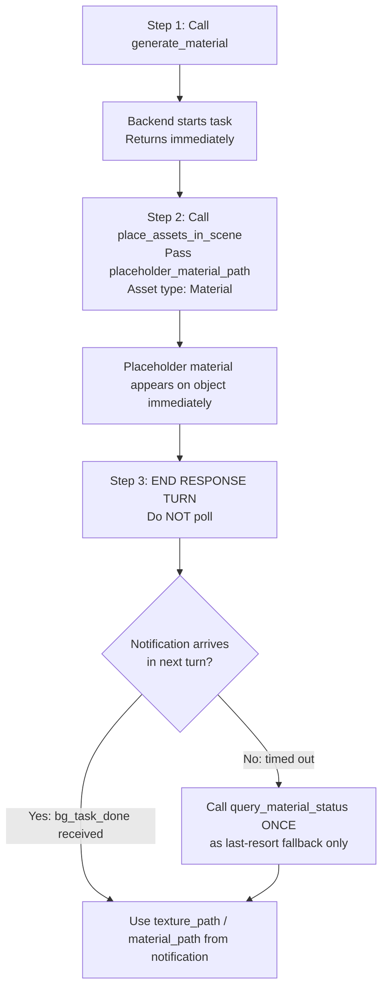

# Generate Surface Material in Unity 🪨

Generate PBR surface material assets in Unity using Huoshan SeeDream AI, from text prompts, reference images, or built-in texture pattern templates.
Output: seamless PNG texture (imported as **Default Texture**) + a ready-to-use **Unity `.mat` Material asset**, auto-saved to `Assets/TJGenerators/History/`.

Supports material type presets (metal, wood, stone, etc.), texture pattern templates (horizontal stripes, honeycomb, cracks, etc.), and surface state styles (new, aged, dirty, wet, weathered) to guide the AI toward the desired look.

## ⚡ CRITICAL: Async Workflow — Notification-Driven, No Polling

- **This API is fully asynchronous (~60–180 seconds). DO NOT block!**
- `generate_material` returns immediately with `task_id` and usable placeholder assets.
- **🚫 POLLING IS STRICTLY FORBIDDEN.** Never call `query_material_status` in a loop or more than once.
  - ❌ Do NOT call `query_material_status` repeatedly
  - ❌ Do NOT loop or wait for status
  - ✅ Apply the placeholder immediately, then **end your response turn**
  - ✅ A `<bg_task_done>` notification arrives **automatically** in your next turn with all results
  - ✅ Use `query_material_status` **at most once**, only as a last-resort fallback if no notification arrives
- Immediately call `place_assets_in_scene` with `placeholder_material_path` and asset type `Material`. A placeholder material appears on the object right away.
- When generation completes, the PNG and `.mat` are **updated in-place** — no rebinding needed.
- **Maximum 5 concurrent tasks** — do not start more than 5 at once.

## **Recommended workflow:**



## Tools

All tools are called via `execute_custom_tool`.

### `generate_material`
Start a material generation task.

```python
execute_custom_tool(
  tool_name="generate_material",
  parameters={
    "prompt": "rough iron plate with surface rust",   # Optional text description
    "generator_id": "huoshan_seedream_material",      # Only available generator (default)
    "image_path": "path/to/ref.png",                  # Optional: reference image
    "preset_id": "metal",                             # Optional: material type (see table below)
    "pattern_id": "horizontal_lines",                 # Optional: texture pattern template (see table below)
    "style_id": "aged",                               # Optional: surface state (see table below)
    "size": "2048x2048",                              # Optional: output resolution (default "2048x2048")
    # output_path: NOT recommended. Default saves to Assets/TJGenerators/History/ which is correct.
    # Only specify if user explicitly requests a custom location.
  }
)
```

**Input — provide at least one of:**
- `prompt` — free-text description of the material appearance
- `preset_id` — selects a material type (adds type-appropriate prompt words automatically)
- `pattern_id` — selects a built-in texture pattern template image as input (see note below)
- `image_path` — your own reference image

> **⚠️ `pattern_id` note:** Pattern templates are local image files that must be pre-generated once using the Unity Editor menu **AI生成 → 开发 → 材质模板生成器**. If the template file does not exist, `pattern_id` is ignored and `image_path` is used as fallback.

**Prompt building:** The combined prompt sent to AI is built as: `preset.prompt + ", " + style.prompt + ", " + your prompt`. You rarely need to write a detailed prompt when `preset_id` and `style_id` are set.

**Returns:**
- `task_id`: Identifier for polling
- `placeholder_path`: Placeholder PNG texture (1×1 gray) — **available immediately**
- `placeholder_material_path`: Placeholder `.mat` Material (Standard shader, gray texture) — **available immediately**, apply to objects now
- `expected_texture_path`: Where the final PNG texture will be saved (same path as placeholder)
- `expected_material_path`: Where the final `.mat` Material will be saved (same path as placeholder)
- `prompt`: The combined prompt sent to AI
- `estimated_wait_seconds`: ~90 seconds
- `notification_mode`: `"bg_task_done"` — confirms automatic notification is supported

**Returns on submission failure:**
```json
{ "success": false, "error_code": "AUTH_REQUIRED", "message": "Not logged in. Open Window → Unity Connect and sign in." }
```
Check `result["success"]` before reading `task_id`. If `false`, report the error immediately and do NOT poll.

> **Placeholder workflow:** Both `placeholder_path` (PNG) and `placeholder_material_path` (`.mat`) are created immediately. Call `place_assets_in_scene` right away with `placeholder_material_path` and asset type `Material`. When generation completes, the PNG is overwritten in-place and the `.mat`'s `mainTexture` is updated automatically — existing Renderer references remain valid. Use `query_material_status` to check when `material_path` is ready.

#### Parameters

| Parameter | Type | Default | Description |
|-----------|------|---------|-------------|
| `generator_id` | string | `"huoshan_seedream_material"` | Generator to use; only `"huoshan_seedream_material"` is available |
| `preset_id` | string | — | Material type preset (see table) |
| `pattern_id` | string | — | Texture pattern template — requires 材质模板生成器 pre-gen |
| `style_id` | string | — | Surface state/style (see table) |
| `prompt` | string | — | Additional free-text description (combined with preset + style) |
| `image_path` | string | — | Reference image; overridden by `pattern_id` if template exists |
| `size` | string | `"2048x2048"` | Output resolution |
| `output_path` | string | — | Custom save path (`.png` / `.mat` appended automatically) |

### `<bg_task_done>` Notification (Primary)

When generation completes, a `<bg_task_done>` notification is automatically injected into your next turn. Its payload contains **all the same fields as `query_material_status`**:

| Field | Description |
|-------|-------------|
| `status` | `"completed"` or `"failed"` |
| `texture_path` | Final PNG texture asset path |
| `material_path` | Final `.mat` Material asset path |
| `preview_url` | Preview URL or local file path |
| `generator_id` | Generator used |
| `prompt` | Original prompt |
| `progress` | `100` when completed |
| `start_time` | Generation start timestamp |
| `end_time` | Generation end timestamp |
| `duration_seconds` | Total generation time |
| `error` | Error message (when `failed`) |

**If you receive this notification, the task is done. Do NOT call `query_material_status`.**

> `session_id` is empty string when notification comes from domain reload recovery path — match by `task_id` or `backend_task_id` instead.

### `query_material_status` — Fallback Only, Do NOT Poll

> ⚠️ **This tool is a last-resort fallback.** Only call it ONCE if no `<bg_task_done>` notification arrives after the estimated wait time. Never call it in a loop.

```python
execute_custom_tool(
  tool_name="query_material_status",
  parameters={"task_id": "material_1_638..."}
)
```

**Returns:** Same fields as the `<bg_task_done>` notification payload above, plus:
- `placeholder_path`: Placeholder PNG path *(only present when `generating`)*
- `placeholder_material_path`: Placeholder `.mat` path *(only present when `generating`)*

### `list_material_tasks`
List all active and recent material tasks.

```python
execute_custom_tool(
  tool_name="list_material_tasks",
  parameters={}
)
```

**Returns:** `{ success: true, count: N, tasks: [...] }` — each entry in `tasks` includes the same fields as `query_material_status`; conditional fields are only present when applicable.

---

## Material Type Presets (`preset_id`)

Specifying a preset provides type-appropriate prompt words and sets `Metallic`/`Smoothness` on the resulting Material automatically.

| ID | 名称 | Category | Metallic | Smoothness |
|----|------|----------|----------|------------|
| `metal` | 金属 | 基础 | 0.9 | 0.8 |
| `wood` | 木头 | 基础 | 0 | 0.3 |
| `stone` | 石头 | 基础 | 0 | 0.1 |
| `fabric` | 布料 | 基础 | 0 | 0.3 |
| `leather` | 皮革 | 基础 | 0 | 0.3 |
| `concrete` | 混凝土 | 建筑 | 0 | 0.1 |
| `brick` | 砖块 | 建筑 | 0 | 0.1 |
| `tile` | 瓷砖 | 建筑 | 0 | 0.1 |
| `glass` | 玻璃 | 透明 | 0 | 0.95 |
| `ceramic` | 陶瓷 | 特殊 | 0 | 0.5 |
| `grass` | 草地 | 自然 | 0 | 0.5 |
| `sand` | 沙地 | 自然 | 0 | 0.5 |
| `snow` | 雪地 | 自然 | 0 | 0.5 |

## Texture Pattern Templates (`pattern_id`)

Pattern templates provide a base image that controls the geometric structure of the generated texture. **Requires pre-generation via 材质模板生成器** (see note above).

| ID | 名称 | 描述 | Category |
|----|------|------|----------|
| `uniform` | 均匀平滑 | 无方向性的平滑表面 | 基础 |
| `horizontal_lines` | 水平条纹 | 水平方向条纹 | 条纹 |
| `vertical_lines` | 垂直条纹 | 垂直方向条纹 | 条纹 |
| `cross_hatch` | 交叉网格 | 交叉网格纹理 | 网格 |
| `diagonal` | 对角线 | 对角方向纹理 | 条纹 |
| `wave` | 波浪 | 波浪形纹理 | 曲线 |
| `noise` | 噪点粗糙 | 随机噪点纹理 | 随机 |
| `honeycomb` | 蜂窝 | 六边形蜂窝纹理 | 几何 |
| `brick_layout` | 砖块排列 | 砖块排列纹理 | 几何 |
| `scales` | 鳞片 | 鳞片状纹理 | 有机 |
| `cracks` | 裂纹 | 裂纹纹理 | 破损 |
| `woven` | 编织 | 编织纹理 | 织物 |

## Surface State Styles (`style_id`)

Styles add wear, aging, or environmental effects on top of the base material.

| ID | 名称 | 描述 |
|----|------|------|
| `new` | 崭新 | 干净、无磨损 |
| `aged` | 做旧 | 有划痕、磨损 |
| `dirty` | 脏污 | 有污渍、灰尘 |
| `wet` | 潮湿 | 有水渍、湿润 |
| `weathered` | 风化 | 自然风化效果 |

## Output Size Options (`size`)

| Value | 说明 |
|-------|------|
| `"1024x1024"` | 1K — small props, mobile-friendly |
| `"2048x2048"` | 2K — standard quality **(default)** |
| `"4096x4096"` | 4K — hero assets, close-up surfaces |

---

## Usage Examples

### Generate by Material Type (Preset)
```python
result = execute_custom_tool(
    tool_name="generate_material",
    parameters={
        "preset_id": "metal",
        "style_id": "aged",
        "prompt": "iron plate with surface rust"
    }
)
if not result.get("success", True):
    raise RuntimeError(f"[{result['error_code']}] {result['message']}")
task_id = result["task_id"]
placeholder_material_path = result["placeholder_material_path"]  # .mat available immediately
# Apply material to object: use place_assets_in_scene skill
# Then end response turn — bg_task_done notification arrives automatically. Do NOT poll.
```

### Generate by Texture Pattern
```python
result = execute_custom_tool(
    tool_name="generate_material",
    parameters={
        "preset_id": "wood",
        "pattern_id": "horizontal_lines",   # Uses template image for structure
        "style_id": "new"
    }
)
```

### Generate from a Reference Image
```python
result = execute_custom_tool(
    tool_name="generate_material",
    parameters={
        "image_path": "Assets/References/brick_photo.jpg",
        "preset_id": "brick",
        "style_id": "weathered"
    }
)
```

### Recommended: Concurrent Fire-and-Forget
```python
# ✅ Start multiple generations and return immediately — don't block!
# Maximum 5 concurrent tasks at a time.

task_ids = []
materials = [
    ("metal", "aged", "rusty iron"),
    ("wood",  "new",  "clean oak planks"),
    ("stone", "weathered", "mossy cobblestone"),
]
for preset, style, prompt in materials:
    result = execute_custom_tool(
        tool_name="generate_material",
        parameters={"preset_id": preset, "style_id": style, "prompt": prompt}
    )
    task_ids.append(result["task_id"])

# End response turn — bg_task_done notifications arrive automatically. Do NOT poll.
return f"Started {len(task_ids)} material generations. Task IDs: {task_ids}"
```

---

## Prompt Writing Guide

`preset_id` and `style_id` handle most of the prompt automatically. Use the `prompt` field only to add specific visual details:

| Goal | Prompt |
|------|--------|
| Specific color | `"dark grey slate with blue-grey tones"` |
| Surface detail | `"fine grain wood with visible knots"` |
| Pattern hint | `"large irregular cobblestone blocks"` |
| Seamless requirement | `"seamless tileable, no visible seams"` |
| Combination | `"rusty iron, orange and brown tones, heavy corrosion"` |

**Tips:**
- Let `preset_id` + `style_id` do the heavy lifting; use `prompt` only for details `preset_id` can't express
- For tileable surfaces, add `"seamless tileable"` to the prompt
- Combine `pattern_id` with `preset_id` to control both structure and material type
- Avoid describing objects (e.g., "a sword") — describe the **surface** itself

---

## Troubleshooting

### "Cannot find material generator config for 'huoshan_seedream_material'"
- Verify `cn.tuanjie.ai.generators` is installed in the Unity project
- Wait for Unity Editor to finish compiling after package install

### "At least one of 'prompt', 'preset_id', 'pattern_id', or 'image_path' must be provided"
- Provide at least one input; `preset_id` alone is sufficient

### `pattern_id` has no effect
- Pattern template images must be pre-generated. Open Unity Editor → **AI生成 → 开发 → 材质模板生成器** and generate the templates
- If the template file is missing, generation falls back to `image_path` or text-only

### Material looks wrong (wrong surface type)
- Set `preset_id` for the correct material category
- Add `style_id` to control surface condition (new/aged/dirty)
- Be specific in `prompt` about color and surface texture details

### Task stuck in "generating"
- Generation normally takes 60–180 seconds
- Check internet connection
- Use `list_material_tasks` to verify the task is tracked
