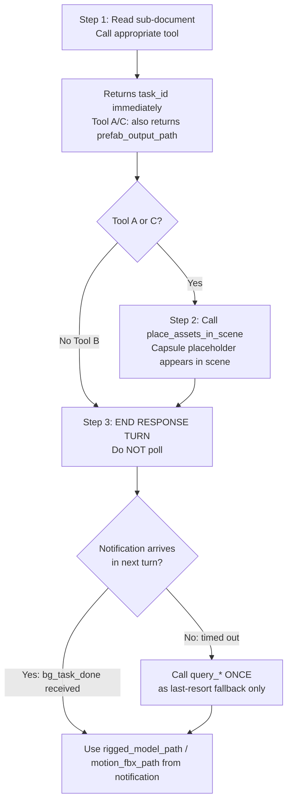

# Rigging / Motion Generation

## ⚠️ Read the sub-document before calling any tool

Before calling any tool, use Read to load the corresponding generator `.md` file for full parameter
reference and return value details.

| Tools | Sub-document |
|-------|-------------|
| `generate_rigged_model` / `query_rigged_model_status` / `list_rigged_model_tasks` | Read `generators/unirig.md` |
| `generate_model_motion` / `query_model_motion_status` / `list_model_motion_tasks` | Read `generators/hunyuan-motion.md` |
| `generate_rigged_animated_model` / `query_rigged_animated_model_status` / `list_rigged_animated_model_tasks` | Read `generators/rig-and-motion.md` |

---

## Decision Tree

```
What does the user want to do with an existing model?
  ├── Rigging only (no animation)           → Tool A: generate_rigged_model
  │                                            Read generators/unirig.md
  ├── Already Humanoid, need motion only    → Tool B: generate_model_motion
  │                                            Read generators/hunyuan-motion.md
  └── Rig + motion in one shot              → Tool C: generate_rigged_animated_model
                                               Read generators/rig-and-motion.md
```

**Important:** To generate a brand-new character with rigging and animation from scratch,
use `generate_animated_character` instead.

---

## ⚡ CRITICAL: Async Workflow — Notification-Driven, No Polling

- **This API is fully asynchronous (Tool A ~1–3 min, Tool B ~1–2 min, Tool C ~2–5 min). DO NOT block!**
- **🚫 POLLING IS STRICTLY FORBIDDEN.** Never call `query_rigged_model_status` / `query_rigged_animated_model_status` in a loop or more than once.
  - ❌ Do NOT call query tools repeatedly
  - ❌ Do NOT loop or wait for status
  - ✅ Apply the placeholder immediately (Tools A/C), then **end your response turn**
  - ✅ A `<bg_task_done>` notification arrives **automatically** in your next turn with all results
  - ✅ Use query tools **at most once**, only as a last-resort fallback if no notification arrives
- When `session_id=""` in a notification, it came from domain reload recovery — match by `task_id` or `backend_task_id` instead.

## Standard Workflow



Typical duration: Tool A ~1–3 min, Tool B ~1–2 min, Tool C ~2–5 min.

## `<bg_task_done>` Notification (Primary)

### For `generate_rigged_model` (Tool A)

| Field | Description |
|-------|-------------|
| `status` | `"completed"` or `"failed"` |
| `pipeline_type` | `"rig_only"` |
| `source_model_path` | Source model path |
| `rigged_model_path` | Rigged Humanoid FBX path |
| `prefab_path` | Prefab path |
| `progress` | `100` when completed |
| `start_time` | Generation start timestamp |
| `end_time` | Generation end timestamp |
| `duration_seconds` | Total generation time |
| `error` | Error message (when `failed`) |

### For `generate_rigged_animated_model` (Tool C)

| Field | Description |
|-------|-------------|
| `status` | `"completed"` or `"failed"` |
| `pipeline_type` | `"rig_and_motion"` |
| `source_model_path` | Source model path |
| `rigged_model_path` | Rigged Humanoid FBX path |
| `motion_fbx_path` | Motion FBX path |
| `controller_path` | AnimatorController path |
| `prefab_path` | Prefab path |
| `progress` | `100` when completed |
| `start_time` | Generation start timestamp |
| `end_time` | Generation end timestamp |
| `duration_seconds` | Total generation time |
| `error` | Error message (when `failed`) |

**If you receive this notification, the task is done. Do NOT call the corresponding query tool.**

> `session_id` is empty string when notification comes from domain reload recovery path — match by `task_id` or `backend_task_id` instead.

---

## Shared Status Values

All three query tools return the same `status` field:

| Status | Applies to | Meaning |
|--------|-----------|---------|
| `initializing` | A/B/C | Task created, not yet submitted to backend |
| `pending` | A/B/C | Task registered; backend submission in progress — keep polling |
| `rigging` | A/C | UniRig Stage 1 in progress (A: 0–100%; C: 0–50%) |
| `rigging_complete` | C | Stage 1 done; Stage 2 launching automatically — keep polling |
| `generating_motion` | B/C | HunyuanMotion in progress (B: 0–100%; C: 50–100%) |
| `completed` | A/B/C | All outputs ready |
| `failed` | A/B/C | Generation failed (A: rigging; B: motion; C: Stage 1) |
| `rigging_complete_motion_failed` | C | Stage 1 succeeded but Stage 2 failed |
| `recovering` | A/B/C | Domain reload occurred; task auto-resuming — keep polling |
| `interrupted` | A/B/C | Domain reload lost the backend record; re-generate required |

---

## Domain Reload Recovery

When Unity recompiles scripts (domain reload), active tasks are automatically resumed.
Status briefly shows `recovering` — keep polling normally.

If status becomes `interrupted`, the backend record was lost. Recovery path depends on pipeline type:

- **Tool A (rig_only):** Re-generate with the same parameters and `force_overwrite=true`.
- **Tool B (motion_only):** Re-generate with the same parameters (`force_overwrite` does not exist for this tool).
- **Tool C (rig_and_motion):** If the response includes `rigged_stage_completed: true`, Stage 1 already
  finished — call `generate_model_motion` directly with `rigged_model_path` to skip re-rigging.
  Otherwise re-generate the full pipeline with `force_overwrite=true`.

---

## Query Tools — Fallback Only, Do NOT Poll

> ⚠️ **These tools are last-resort fallbacks.** Only call them ONCE if no `<bg_task_done>` notification arrives after the estimated wait time. Never call them in a loop.

| Tool | Estimated total time |
|------|---------------------|
| `query_rigged_model_status` | ~1–3 min |
| `query_model_motion_status` | ~1–2 min |
| `query_rigged_animated_model_status` | ~2–5 min |
