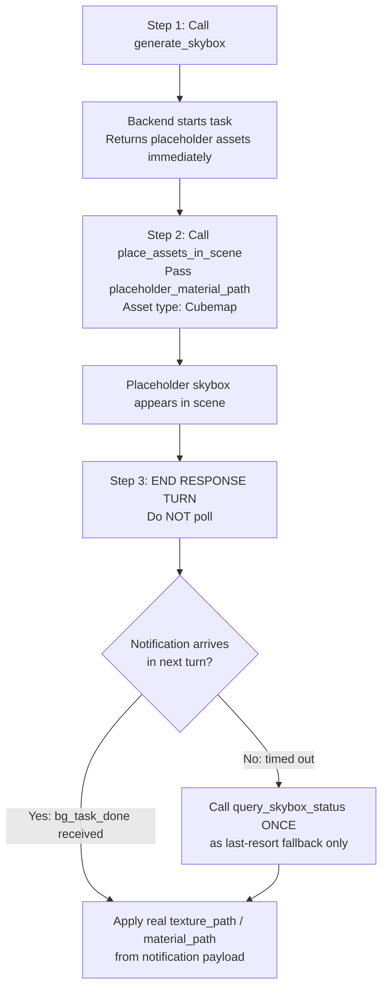

# Generate Skybox in Unity 🌅

Generate Cubemap skybox assets in Unity using Rodin Skybox AI, from text prompts or reference images.
Output: PNG imported as **TextureCube (Cubemap)**, auto-saved to `Assets/TJGenerators/History/`.

## When NOT to Use
- User wants a 3D model → use `unity-3d-generation` skill
- User wants a 2D sprite or texture → use the sprite generation skill
- User wants an animated character → use `unity-animated-character-generation` skill

## ⚡ CRITICAL: Async Workflow — Notification-Driven, No Polling

- **This API is fully asynchronous (~60–180 seconds). DO NOT block!**
- `generate_skybox` returns immediately with `task_id` and `placeholder_material_path`.
- **🚫 POLLING IS STRICTLY FORBIDDEN.** Never call `query_skybox_status` in a loop or more than once.
  - ❌ Do NOT call `query_skybox_status` repeatedly
  - ❌ Do NOT loop or wait for status
  - ✅ Apply the placeholder immediately, then **end your response turn**
  - ✅ A `<bg_task_done>` notification arrives **automatically** in your next turn with all results
  - ✅ Use `query_skybox_status` **at most once**, only as a last-resort fallback if no notification arrives

## Recommended Workflow



> When generation completes, the skybox material is **updated in-place** — no rebinding needed if placeholder was applied via `place_assets_in_scene`.

## Tools

All tools are called via `execute_custom_tool`.

### `generate_skybox`
Start a skybox generation task.

```python
execute_custom_tool(
  tool_name="generate_skybox",
  parameters={
    "generator_id": "rodin-skybox",          # Only available generator (default)
    "prompt": "sunset over ocean, dramatic orange sky",  # Text description
    "image_path": "path/to/reference.png",   # Optional: reference image
    "output_path": "Assets/Skyboxes/MySky",  # Optional: custom save path (adds .png)
    "resolution": "2048",                    # Optional: "512"|"1024"|"2048"|"4096"
    "high_res": False,                       # Optional: bool, high-resolution mode
    # output_path: NOT recommended. Default saves to Assets/TJGenerators/History/ which is correct.
    # Only specify output_path if user explicitly requests a custom save location.
  }
)
```

**Required:** At least one of `prompt` or `image_path`

**Returns on success:**
- `task_id`: Task identifier
- `placeholder_path`: Placeholder Cubemap PNG (1×1 gray) — **available immediately**
- `placeholder_material_path`: Placeholder Skybox/Cubemap `.mat` Material — **available immediately**
- `estimated_wait_seconds`: ~90 seconds
- `notification_mode`: `"bg_task_done"` — confirms automatic notification is supported

**Returns on submission failure:**
```json
{ "success": false, "error_code": "AUTH_REQUIRED", "message": "Not logged in. Open Window → Unity Connect and sign in." }
```
Check `result["success"]` before reading `task_id`. If `false`, report the error immediately.

> **Placeholder workflow:** Both `placeholder_path` (Cubemap PNG) and `placeholder_material_path` (Skybox `.mat`) are created immediately. Call `place_assets_in_scene` right away. When generation completes, the material is updated in-place — the `<bg_task_done>` notification delivers the final `texture_path` and `material_path`.

#### Parameters

| Parameter | Type | Default | Description |
|-----------|------|---------|-------------|
| `generator_id` | string | `"rodin-skybox"` | Generator to use; only `"rodin-skybox"` is available |
| `prompt` | string | — | Text description of the skybox atmosphere |
| `image_path` | string | — | Reference image for style guidance |
| `output_path` | string | — | Custom save path (`.png` appended automatically) |
| `resolution` | string | `"2048"` | Output resolution: `"512"` \| `"1024"` \| `"2048"` \| `"4096"` |
| `high_res` | bool | `false` | Enable high-resolution mode |

> Higher resolution → better quality but slower and larger file. `"2048"` is a good balance for most game scenes. Use `"4096"` only for cinematic or hero environments.

### `<bg_task_done>` Notification (Primary)

When generation completes, a `<bg_task_done>` notification is automatically injected into your next turn. Its payload contains **all the same fields as `query_skybox_status`**:

| Field | Description |
|-------|-------------|
| `status` | `"completed"` or `"failed"` |
| `texture_path` | Final Cubemap asset path in project |
| `material_path` | Skybox `.mat` material path |
| `preview_url` | Preview URL or local file path |
| `generator_id` | Generator used |
| `prompt` | Original prompt |
| `image_path` | Original image path (if used) |
| `progress` | `100` when completed |
| `start_time` | Generation start timestamp |
| `end_time` | Generation end timestamp |
| `duration_seconds` | Total generation time |
| `error` | Error message (when `failed`) |

**If you receive this notification, the task is done. Do NOT call `query_skybox_status`.**

### `query_skybox_status` — Fallback Only, Do NOT Poll

> ⚠️ **This tool is a last-resort fallback.** Only call it ONCE if no `<bg_task_done>` notification arrives after the estimated wait time. Never call it in a loop.

```python
execute_custom_tool(
  tool_name="query_skybox_status",
  parameters={"task_id": "skybox_1_638..."}
)
```

**Returns:** Same fields as the `<bg_task_done>` notification payload above, plus:
- `placeholder_path` / `placeholder_material_path`: *(only present when `generating`)*

### `list_skybox_tasks`
List all active and recent skybox tasks.

```python
execute_custom_tool(
  tool_name="list_skybox_tasks",
  parameters={}
)
```

**Returns:** `{ success: true, count: N, tasks: [...] }` — each entry includes the same fields as the notification payload; conditional fields are only present when applicable.

## Usage Examples

### Generate from Text
```python
result = execute_custom_tool(
    tool_name="generate_skybox",
    parameters={
        "prompt": "night sky with stars, milky way visible, deep blue"
    }
)
if not result.get("success", True):
    raise RuntimeError(f"[{result['error_code']}] {result['message']}")

task_id = result["task_id"]
placeholder_material_path = result["placeholder_material_path"]

# Step 2: apply placeholder immediately using place_assets_in_scene skill
# Step 3: end response turn — bg_task_done notification will arrive automatically
# Do NOT poll query_skybox_status
```

### Generate from Reference Image
```python
result = execute_custom_tool(
    tool_name="generate_skybox",
    parameters={
        "image_path": "Assets/ConceptArt/environment_concept.png",
        "resolution": "4096"
    }
)
```

### Generate with Custom Output Path
```python
result = execute_custom_tool(
    tool_name="generate_skybox",
    parameters={
        "prompt": "fantasy sunset with purple clouds and twin moons",
        "output_path": "Assets/Environments/FantasySky",
        "resolution": "2048",
        "high_res": True
    }
)
```

## Prompt Writing Guide

Good skybox prompts describe the **overall atmosphere** rather than specific objects:

| Goal | Prompt |
|------|--------|
| Daytime outdoor | `"clear blue sky, white fluffy clouds, bright sunny day"` |
| Sunset | `"dramatic orange and pink sunset, golden hour lighting"` |
| Night | `"starry night sky, milky way, deep blue, moonlit"` |
| Storm | `"dark stormy sky, heavy clouds, lightning, dramatic lighting"` |
| Fantasy | `"fantasy twin moons, purple nebula sky, magical atmosphere"` |
| Sci-fi | `"alien planet sky, red atmosphere, distant ringed planet"` |
| Indoor (studio) | `"neutral gray studio background, soft even lighting, HDRI"` |

**Tips:**
- Describe lighting quality: "soft", "dramatic", "harsh", "overcast"
- Mention time of day: "dawn", "dusk", "midnight", "noon"
- Add mood: "peaceful", "ominous", "epic", "serene"
- Avoid describing specific foreground objects — focus on sky and atmosphere

## Troubleshooting

### "Cannot find skybox generator config for 'rodin-skybox'"
The TJGenerators package is not installed or the config hasn't loaded. Check:
- `cn.tuanjie.ai.generators` is in the project's `Packages/manifest.json`
- Unity Editor has finished compiling

### Task stuck in "generating" / No notification arrives
- Normal generation time is 60–180 seconds
- Check internet connection
- If no `<bg_task_done>` notification arrives, call `query_skybox_status` **once** to check status
- Use `list_skybox_tasks` to verify the task exists

### Cubemap appears black or missing
- Check `texture_path` is a valid asset path
- Reimport: right-click the asset in Project → Reimport
- Verify TextureImporter shape is "Cube" in Inspector

### Poor quality output
- Use a more descriptive prompt (see Prompt Writing Guide)
- Try `resolution: "4096"` with `high_res: true`
- Provide a reference image (`image_path`) for better style matching
