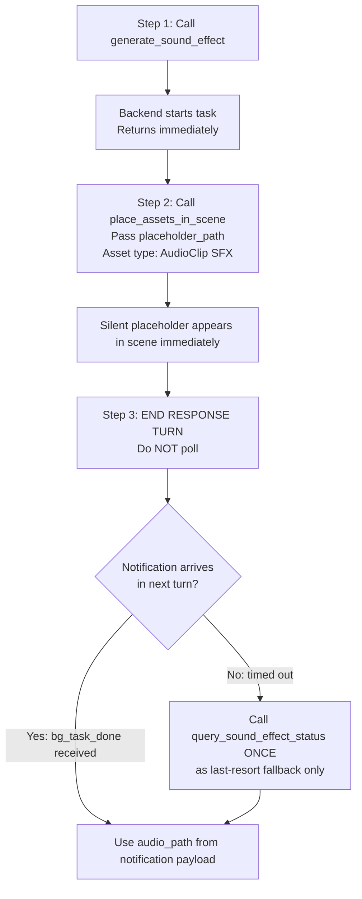

# Generate Sound Effect (SFX) in Unity 💥

Generate **one-shot sound effect** assets in Unity using AI, from text descriptions of the sound.
Output: audio file auto-imported as **AudioClip**, saved to `Assets/TJGenerators/History/`.

> **⚠️ Sound effects only.** This tool generates short, one-shot SFX clips. For background music, BGM, or looping ambient audio, use the **`generate_audio_clip`** skill instead.

## When NOT to Use
- **User wants background music (BGM) or ambient looping audio** → Use the **`generate_audio_clip`** skill instead. Do NOT use this skill for BGM.
- User wants a 3D model → use `unity-3d-generation` skill
- User wants a skybox or environment texture → use `unity-skybox-generation` skill
- User wants to edit or mix existing audio files (this tool only generates new audio)

## ⚠️ CRITICAL: Prompt Language Requirement

**The `prompt` parameter MUST be written in English.** The SFX generation API only supports English text descriptions.

- ✅ `"sharp wooden door knock, three rapid knocks"`
- ✅ `"massive explosion, deep bass rumble, scattered debris falling"`
- ❌ `"木门敲击声，三次快速敲击"` — Chinese prompts will NOT work correctly

**If the user provides a Chinese description, translate it to English before calling `generate_sound_effect`.**

## ⚡ CRITICAL: Async Workflow — Notification-Driven, No Polling

- **This API is fully asynchronous (~10–60 seconds). DO NOT block!**
- `generate_sound_effect` returns immediately with `task_id` and `placeholder_path`.
- **🚫 POLLING IS STRICTLY FORBIDDEN.** Never call `query_sound_effect_status` in a loop or more than once.
  - ❌ Do NOT call `query_sound_effect_status` repeatedly
  - ❌ Do NOT loop or wait for status
  - ✅ Apply the placeholder immediately, then **end your response turn**
  - ✅ A `<bg_task_done>` notification arrives **automatically** in your next turn with all results
  - ✅ Use `query_sound_effect_status` **at most once**, only as a last-resort fallback if no notification arrives
- Immediately call `place_assets_in_scene` with `placeholder_path` and asset type `AudioClip SFX`. A silent placeholder MP3 appears right away.
- When generation completes, the file is **overwritten in-place** — no rebinding needed.

## **Recommended workflow:**



## Tools

All tools are called via `execute_custom_tool`.

### `generate_sound_effect`
Start a sound effect generation task.

```python
execute_custom_tool(
  tool_name="generate_sound_effect",
  parameters={
    "prompt": "powerful explosion with debris, low rumble and sharp crack",  # Required
    "duration_seconds": 5,          # Optional: float, 1-22 seconds, default 5
    "prompt_influence": 0.5,        # Optional: float, 0-1, how strongly prompt shapes result, default 0.5
    "output_format": "",            # Optional: string, e.g. "mp3_44100_128"; default is server default
    "loop": False,                  # Optional: bool, generate a loopable SFX, default False
    "play_on_awake": False,         # Optional: bool, whether AudioSource plays on Play Mode start, default False
    # output_path: NOT recommended. Default saves to Assets/TJGenerators/History/ which is correct.
    # Only specify output_path if user explicitly requests a custom save location.
  }
)
```

> **⚠️ Do NOT specify `output_path` unless the user explicitly requests it.** The default save path `Assets/TJGenerators/History/` is the standard location for all generated assets.

**Required:** `prompt` — describe the sound effect (what makes the sound, how it sounds, context)
**Returns:**
- `task_id`: Identifier for status queries
- `placeholder_path`: MP3 placeholder asset path — **available immediately**, assign to AudioSource right away
- `estimated_wait_seconds`: ~30 seconds
- `notification_mode`: `"bg_task_done"` — confirms automatic notification is supported

**Returns on submission failure:**
```json
{ "success": false, "error_code": "AUTH_REQUIRED", "message": "Not logged in. Open Window → Unity Connect and sign in." }
```
Check `result["success"]` before reading `task_id`. If `false`, report the error immediately and do NOT poll.

> **Placeholder workflow:** `placeholder_path` is a minimal silent MP3 asset created at the start. Call `place_assets_in_scene` right away with asset type `AudioClip SFX`. When generation completes, the file is overwritten in-place — no rebinding needed.

#### Parameters

| Parameter | Type | Default | Description |
|-----------|------|---------|-------------|
| `prompt` | string | **required** | Sound effect description in English (source, action, material, acoustic context) |
| `duration_seconds` | float | `5` | Length in seconds (1–22). Short SFX: 0.5–2s; explosions/crashes: 2–5s; long ambient one-shots: 5–22s |
| `prompt_influence` | float | `0.5` | How strongly the prompt shapes the output: `0.0` = more creative variation, `0.5` = balanced, `1.0` = strict |
| `output_format` | string | server default | Audio encoding format (e.g. `"mp3_44100_128"`, `"mp3_44100_192"`, `"pcm_44100"`, `"opus_48000_128"`) |
| `loop` | bool | `false` | Generate a sound designed for seamless looping (use for rain, engine hum, crowd noise) |
| `play_on_awake` | bool | `false` | Whether the AudioSource plays automatically when entering Play Mode. Set to `true` for ambient loops that should start immediately |
| `output_path` | string | — | Custom save path; omit to use default |

### `<bg_task_done>` Notification (Primary)

When generation completes, a `<bg_task_done>` notification is automatically injected into your next turn. Its payload contains **all the same fields as `query_sound_effect_status`**:

| Field | Description |
|-------|-------------|
| `status` | `"completed"` or `"failed"` |
| `audio_path` | Final AudioClip asset path |
| `preview_url` | Audio preview URL or local file path |
| `generator_id` | Generator used |
| `prompt` | Original prompt |
| `progress` | `100` when completed |
| `start_time` | Generation start timestamp |
| `end_time` | Generation end timestamp |
| `duration_seconds` | Total generation time |
| `error` | Error message (when `failed`) |

**If you receive this notification, the task is done. Do NOT call `query_sound_effect_status`.**

> `session_id` is empty string when notification comes from domain reload recovery path — match by `task_id` or `backend_task_id` instead.

### `query_sound_effect_status` — Fallback Only, Do NOT Poll

> ⚠️ **This tool is a last-resort fallback.** Only call it ONCE if no `<bg_task_done>` notification arrives after the estimated wait time. Never call it in a loop.

```python
execute_custom_tool(
  tool_name="query_sound_effect_status",
  parameters={"task_id": "audio_1_638..."}
)
```

**Returns:** Same fields as the `<bg_task_done>` notification payload above, plus:
- `placeholder_path`: Placeholder path *(only present when `generating`)*

### `list_sound_effect_tasks`
List all active and recent sound effect tasks.

```python
execute_custom_tool(
  tool_name="list_sound_effect_tasks",
  parameters={}
)
```

**Returns:** `{ success: true, count: N, tasks: [...] }` — each entry in `tasks` includes the same fields as `query_sound_effect_status`; conditional fields are only present when applicable.

## Usage Examples

### Generate a Simple Sound Effect
```python
result = execute_custom_tool(
    tool_name="generate_sound_effect",
    parameters={
        "prompt": "sharp wooden door knock, three rapid knocks",
        "duration_seconds": 2
    }
)
if not result.get("success", True):
    raise RuntimeError(f"[{result['error_code']}] {result['message']}")
task_id = result["task_id"]
placeholder_path = result["placeholder_path"]  # MP3 available immediately
# → {"success": true, "task_id": "audio_1_...",
#    "placeholder_path": "Assets/TJGenerators/History/SFX_20260304_120000.mp3"}

# Assign SFX AudioSource: use place_assets_in_scene skill with asset type AudioClip SFX
# Then end response turn — bg_task_done notification arrives automatically. Do NOT poll.
```

### Generate a Looping Ambient Sound
```python
result = execute_custom_tool(
    tool_name="generate_sound_effect",
    parameters={
        "prompt": "steady rainfall on a window, medium intensity",
        "duration_seconds": 10,
        "loop": True
    }
)
```

### High-Quality Explosion
```python
result = execute_custom_tool(
    tool_name="generate_sound_effect",
    parameters={
        "prompt": "massive explosion, deep bass rumble, scattered debris falling",
        "duration_seconds": 4,
        "prompt_influence": 0.8,
        "output_format": "mp3_44100_192"
    }
)
```

## Prompt Writing Guide

Write prompts that describe **the source, action, material, and sonic character** of the sound:

| Sound Type | Example Prompt |
|------------|----------------|
| Gunshot | `"single pistol gunshot, sharp crack, indoor reverb"` |
| Explosion | `"large explosion, deep bass shockwave, debris rattle"` |
| Footsteps | `"three heavy footsteps on wet gravel, slow pace"` |
| UI click | `"soft UI button click, clean and satisfying, slight tap"` |
| Item pickup | `"bright coin pickup chime, cheerful ding, quick fade"` |
| Door creak | `"old wooden door creaking open slowly, haunting tone"` |
| Magic spell | `"mystical magic spell cast, whoosh with sparkle shimmer"` |
| Engine | `"car engine revving, V8, aggressive acceleration"` |
| Rain burst | `"sudden heavy rain burst on leaves, natural outdoor"` |
| Jump/land | `"character jump with grunt and landing thud on grass"` |

**Tips:**
- Name the **source object**: door, sword, gun, footstep, button
- Describe the **action**: click, slam, crack, whoosh, creak
- Mention **material**: wood, metal, stone, glass, flesh
- Add **acoustic context**: indoor reverb, outdoor echo, muffled, crisp
- Describe **duration feel**: short snap, long rumble, quick fade

## Troubleshooting

### "Cannot find generator config for 'sound-effect'"
The TJGenerators package is not installed or the config hasn't loaded. Check:
- `cn.tuanjie.ai.generators` is in `Packages/manifest.json`
- Unity Editor has finished compiling

### Task lost after domain reload (task_id no longer valid)
Task state is normally auto-managed. Prefer `execute_csharp_script` or `place_assets_in_scene`; unless explicitly requested, do not write `.cs` files to disk.

### Task stuck in "generating"
- Normal generation time is 10–60 seconds
- Longer `duration_seconds` values take more time
- Check internet connection
- Use `list_sound_effect_tasks` to verify the task exists

### Sound doesn't match prompt
- Be more specific about the source material and action
- Increase `prompt_influence` towards `1.0` for stricter prompt following
- Simplify the prompt — one clear sound source per generation
- Adjust `duration_seconds` to match the expected sound length

### AudioClip import issues in Unity
- Right-click the asset in the Project window → Reimport
- Check that the audio file exists at `audio_path`
