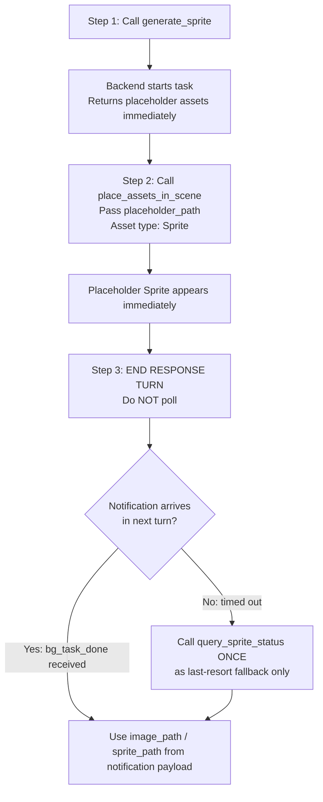

# Generate 2D Sprite in Unity 🎨

Generate 2D Sprite assets in Unity using Huoshan SeeDream AI, from text prompts or reference images.
Output: PNG imported as **Sprite (Texture2D)**, auto-saved to `Assets/TJGenerators/History/`.

Supports content type selection (weapons, armor, icons, UI, characters, etc.) and art style selection (pixel art, anime, cartoon, realistic, etc.) to guide the AI towards the right look.

## ⚡ CRITICAL: Async Workflow — Notification-Driven, No Polling

- **This API is fully asynchronous (~60–180 seconds). DO NOT block!**
- `generate_sprite` returns immediately with `task_id` and `placeholder_path`.
- **🚫 POLLING IS STRICTLY FORBIDDEN.** Never call `query_sprite_status` in a loop or more than once.
  - ❌ Do NOT call `query_sprite_status` repeatedly
  - ❌ Do NOT loop or wait for status
  - ✅ Apply the placeholder immediately, then **end your response turn**
  - ✅ A `<bg_task_done>` notification arrives **automatically** in your next turn with all results
  - ✅ Use `query_sprite_status` **at most once**, only as a last-resort fallback if no notification arrives

## Recommended Workflow



**Key Points:**
- `generate_sprite` returns immediately with a `task_id` **and a usable `placeholder_path`**
- The placeholder Sprite (1×1 gray PNG) is available immediately — call `place_assets_in_scene` right away with asset type `Sprite`
- Generation runs in background (~60–180 seconds); placeholder auto-replaced when done
- **Maximum 5 concurrent tasks** — do not start more than 5 at once
- When `session_id=""` in a notification, it came from domain reload recovery — match by `task_id` or `backend_task_id` instead

## When to Use
- User wants to generate a game icon, item image, UI element, or character portrait
- User says "精灵图", "sprite", "图标", "icon", "道具图", "角色头像", "2D图片"
- User is building a game and needs visual assets for items, skills, characters, or UI
- User wants a reference image turned into a game-ready sprite

## When NOT to Use
- User wants a 3D model → use `unity-3d-generation` skill
- User wants a skybox or environment → use `unity-skybox-generation` skill
- User wants background music or sound → use `unity-audio-clip-generation` skill
- User wants surface material textures → use material generation (handled by a separate window)

## Tools

All tools are called via `execute_custom_tool`.

### generate_sprite
Start a sprite generation task.

```bash
execute_custom_tool(
  tool_name="generate_sprite",
  parameters={
    "prompt": "golden sword with glowing runes, fantasy RPG weapon",  # Text description
    "generator_id": "huoshan_seedream",   # Only available generator (default)
    "image_path": "path/to/ref.png",      # Optional: reference image
    "type_id": "weapon_melee",            # Optional: content type ID (see table below)
    "style_id": "pixel",                  # Optional: art style ID (see table below)
    "is_segmentation": True,              # Optional: auto-remove background (default True)
    "size": "2048x2048",                  # Optional: output resolution (default "2048x2048")
    "q_value": 75,                        # Optional: compression quality 1-100 (default 75)
    "resize_width": 0,                    # Optional: output width in px, 0 = no resize
    # output_path: NOT recommended. Default saves to Assets/TJGenerators/History/ which is correct.
    # Only specify if user explicitly requests a custom location.
  }
)
```

**Required:** At least one of `prompt` or `image_path`
**Returns:**
- `task_id`: Identifier for status queries
- `placeholder_path`: Placeholder Sprite PNG (1×1 gray) — **available immediately**, assign to SpriteRenderer now
- `type_id` / `style_id`: Echoed back if provided
- `estimated_wait_seconds`: ~90 seconds
- `notification_mode`: `"bg_task_done"` — confirms automatic notification is supported

**Returns on submission failure:**
```json
{ "success": false, "error_code": "AUTH_REQUIRED", "message": "Not logged in. Open Window → Unity Connect and sign in." }
```
Check `result["success"]` before reading `task_id`. If `false`, report the error immediately and do NOT poll.

> **Placeholder workflow:** `placeholder_path` is a 1×1 gray PNG imported as a Sprite。立即调用 `place_assets_in_scene`，传入 `placeholder_path` 和资产类型 `Sprite`。当生成完成时，文件会原地替换为真实 Sprite。使用 `query_sprite_status` 查询何时拿到 `sprite_path`。

### `<bg_task_done>` Notification (Primary)

When generation completes, a `<bg_task_done>` notification is automatically injected into your next turn. Its payload contains **all the same fields as `query_sprite_status`**:

| Field | Description |
|-------|-------------|
| `status` | `"completed"` or `"failed"` |
| `image_path` | Final Sprite asset path in the project |
| `preview_url` | Preview URL or local file path |
| `generator_id` | Generator used |
| `prompt` | Original prompt |
| `progress` | `100` when completed |
| `start_time` | Generation start timestamp |
| `end_time` | Generation end timestamp |
| `duration_seconds` | Total generation time |
| `error` | Error message (when `failed`) |

**If you receive this notification, the task is done. Do NOT call `query_sprite_status`.**

> `session_id` is empty string when notification comes from domain reload recovery path — match by `task_id` or `backend_task_id` instead.

### `query_sprite_status` — Fallback Only, Do NOT Poll

> ⚠️ **This tool is a last-resort fallback.** Only call it ONCE if no `<bg_task_done>` notification arrives after the estimated wait time. Never call it in a loop.

```bash
execute_custom_tool(
  tool_name="query_sprite_status",
  parameters={"task_id": "sprite_1_638..."}
)
```

**Returns:** Same fields as the `<bg_task_done>` notification payload above, plus:
- `sprite_path`: Final Sprite asset path (alias for `image_path`, when `completed`)
- `placeholder_path`: Placeholder Sprite path *(only present when `generating`)*

### list_sprite_tasks
List all active and recent sprite tasks.

```bash
execute_custom_tool(
  tool_name="list_sprite_tasks",
  parameters={}
)
```

**Returns:** `{ success: true, count: N, tasks: [...] }` — object with a `tasks` array of all tracked task objects.

## Content Type IDs (`type_id`)

Specifying a type helps the AI understand the subject and apply appropriate composition.

| ID | 名称 | Category |
|----|------|----------|
| `weapon_melee` | 近战武器（剑、斧、锤） | 武器 |
| `weapon_ranged` | 远程武器（弓、枪） | 武器 |
| `weapon_magic` | 魔法武器（法杖、魔导书） | 武器 |
| `armor_head` | 头部装备（头盔、帽子） | 护甲 |
| `armor_body` | 身体装备（胸甲、长袍） | 护甲 |
| `armor_shield` | 盾牌 | 护甲 |
| `armor_accessory` | 饰品（戒指、项链） | 饰品 |
| `consumable_hp` | 生命恢复（药水、食物） | 消耗品 |
| `consumable_mp` | 魔法恢复（法力药水） | 消耗品 |
| `consumable_buff` | 增益道具（药剂、卷轴） | 消耗品 |
| `material_common` | 普通材料（矿石、木材） | 材料 |
| `material_rare` | 稀有材料（精金、龙鳞） | 材料 |
| `material_epic` | 史诗材料（远古遗物） | 材料 |
| `key_item` | 关键物品（任务道具） | 特殊 |
| `quest_item` | 任务物品 | 特殊 |
| `tool_gathering` | 采集工具（镐、钓竿） | 工具 |
| `tool_crafting` | 制造工具（锤子、熔炉） | 工具 |
| `mount` | 坐骑（马、龙） | 角色 |
| `pet` | 宠物（狼、精灵） | 角色 |
| `furniture` | 家具 | 场景 |
| `decoration` | 装饰物（雕像、旗帜） | 场景 |
| `ui_button` | 按钮图标 | UI |
| `ui_icon` | 功能图标 | UI |
| `ui_frame` | 边框装饰 | UI |
| `skill_active` | 主动技能图标 | 技能 |
| `skill_passive` | 被动技能图标 | 技能 |
| `effect_buff` | 增益特效图标 | 效果 |
| `effect_debuff` | 减益特效图标 | 效果 |
| `character_hero` | 英雄头像 | 角色 |
| `character_npc` | NPC头像 | 角色 |
| `monster` | 怪物图标 | 角色 |

## Art Style IDs (`style_id`)

Specifying a style guides the visual treatment. Combine with `type_id` for best results.

| ID | 名称 | Best For |
|----|------|----------|
| `pixel` | 像素艺术 | Retro, classic games |
| `pixel_8bit` | 8位像素 | 8-bit era look |
| `pixel_16bit` | 16位像素 | 16-bit era look |
| `cartoon` | 美式卡通 | Casual, colorful games |
| `anime` | 日式动漫 | JRPG, visual novels |
| `chibi` | Q版可爱 | Mobile, cute games |
| `realistic` | 写实 | AAA, immersive games |
| `semi_realistic` | 半写实 | Action RPG |
| `flat` | 扁平设计 | Mobile UI, casual |
| `vector` | 矢量艺术 | Clean, scalable icons |
| `watercolor` | 水彩画 | Indie, artistic |
| `oil_painting` | 油画 | Historical, artistic |
| `sketch` | 素描草图 | Concept art, rough draft |
| `lineart` | 线稿 | Minimalist, clean |
| `cell_shading` | 赛璐珞 | Stylized animation |
| `low_poly` | 低多边形 | Geometric, minimal |
| `isometric` | 等轴测 | Strategy, city builders |
| `top_down` | 俯视视角 | Top-down games |
| `side_scroller` | 横版卷轴 | Platformers, action |
| `cyberpunk` | 赛博朋克 | Sci-fi, neon |
| `steampunk` | 蒸汽朋克 | Victorian, industrial |
| `fantasy` | 奇幻 | Fantasy RPG |
| `sci_fi` | 科幻 | Space, future |
| `horror` | 恐怖 | Dark, horror |
| `cute` | 可爱 | Kawaii, casual |
| `gothic` | 哥特 | Dark fantasy |
| `medieval` | 中世纪 | Historical RPG |
| `minimalist` | 极简主义 | Clean, modern |
| `hand_drawn` | 手绘 | Indie, personal |

## Output Size Options (`size`)

**⚠️ IMPORTANT: Minimum size is ~1920x1920 (3686400 pixels). Smaller sizes will fail with 400 error.**

Default: `"2048x2048"`. Available sizes:

> **⚠️ IMPORTANT: Minimum size is ~1920×1920 (3,686,400 pixels). Smaller sizes will fail with a 400 error.**

| Value | 说明 |
|-------|------|
| `"2048x2048"` | 2K 1:1 — icons, most items **(default)** |
| `"2304x1728"` | 2K 4:3 — landscape cards |
| `"1728x2304"` | 2K 3:4 — portrait cards |
| `"2560x1440"` | 2K 16:9 — wide landscape |
| `"1440x2560"` | 2K 9:16 — tall portrait |
| `"2496x1664"` | 2K 3:2 — standard photo ratio |
| `"1664x2496"` | 2K 2:3 — standard photo portrait |
| `"3024x1296"` | 2K 21:9 — ultra-wide banner |

## Usage Examples

### Generate an RPG Item Icon
```python
result = execute_custom_tool(
    tool_name="generate_sprite",
    parameters={
        "prompt": "ancient magic staff with glowing blue crystal",
        "type_id": "weapon_magic",
        "style_id": "fantasy"
    }
)
task_id = result["task_id"]
placeholder_path = result["placeholder_path"]  # 1×1 gray Sprite available immediately
# 立即调用 place_assets_in_scene skill，传入 sprite_path（即 placeholder_path）和资产类型 Sprite
# 然后结束 response turn — bg_task_done 通知会自动到来，do NOT poll
```

### Pixel Art Sword
```python
result = execute_custom_tool(
    tool_name="generate_sprite",
    parameters={
        "prompt": "iron sword, simple shape, bright colors",
        "type_id": "weapon_melee",
        "style_id": "pixel_16bit",
        "size": "2048x2048"
    }
)
```

### Anime Character Portrait
```python
result = execute_custom_tool(
    tool_name="generate_sprite",
    parameters={
        "prompt": "young female mage with silver hair and blue eyes",
        "type_id": "character_hero",
        "style_id": "anime",
        "size": "1728x2304",
        "is_segmentation": True
    }
)
```

### From Reference Image
```python
result = execute_custom_tool(
    tool_name="generate_sprite",
    parameters={
        "image_path": "Assets/ConceptArt/potion_sketch.png",
        "type_id": "consumable_hp",
        "style_id": "cartoon"
    }
)
```

### Concurrent Generation (RECOMMENDED for multiple items)
```python
# Generate multiple item icons at once — MAXIMUM 5 concurrent tasks
task_ids = []
items = [
    ("fantasy sword with glowing runes", "weapon_melee", "Assets/Items/Sword"),
    ("golden shield with dragon emblem", "armor_shield", "Assets/Items/Shield"),
    ("red health potion in glass bottle", "consumable_hp", "Assets/Items/HealthPotion"),
]

for prompt, type_id, output_path in items:
    result = execute_custom_tool(
        tool_name="generate_sprite",
        parameters={
            "prompt": prompt,
            "type_id": type_id,
            "style_id": "fantasy",
            "output_path": output_path
        }
    )
    task_ids.append(result["task_id"])
    # Continue immediately — do NOT poll!

# End response turn — bg_task_done notifications arrive automatically for each task
return f"Started {len(task_ids)} sprite generations. Task IDs: {task_ids}"
```

### End-to-End Example: Generate + Place (Placeholder Workflow)

```python
result = execute_custom_tool(
    tool_name="generate_sprite",
    parameters={
        "prompt": "red health potion, glowing liquid, glass bottle",
        "type_id": "consumable_hp",
        "style_id": "fantasy",
        "output_path": "Assets/Icons/HealthPotion"
    }
)
if not result.get("success", True):
    raise RuntimeError(f"[{result['error_code']}] {result['message']}")
task_id = result["task_id"]
placeholder_path = result["placeholder_path"]
```

在 `placeholder_path` 返回后，立即调用 `place_assets_in_scene` skill，传入 `sprite_path`（即 `placeholder_path`）和资产类型 `Sprite`，建立 `SpriteRenderer` 或 `UI Image`。`placeholder_path == sprite_path`，生成完成后会自动显示真实精灵，**无需二次调用**。

结束 response turn — `<bg_task_done>` 通知会自动到来，包含 `image_path`。Do NOT poll `query_sprite_status`。

## Prompt Writing Guide

Think of the prompt as a brief to an illustrator. The `type_id` and `style_id` handle the overall category and art style — the prompt should focus on specific visual details:

| Goal | Prompt |
|------|--------|
| Item icon | `"red health potion in a glass bottle with cork stopper, glowing liquid"` |
| Weapon | `"ornate golden sword with gem-encrusted crossguard, magical runes"` |
| Armor | `"dark iron full plate armor, battle-worn, gothic engravings"` |
| Character | `"young male warrior, short brown hair, determined expression, half-body"` |
| UI icon | `"shield icon representing defense stat, clean and bold"` |
| Skill icon | `"fire tornado spell effect, swirling flames, circular composition"` |

**Tips:**
- Focus on **color**: "golden", "deep blue", "blood red"
- Describe **materials**: "leather", "enchanted crystal", "rusted iron"
- Include **composition hints**: "centered", "full body", "half-body portrait"
- Keep it concise — overly long prompts can confuse the model

## Parameters Quick Reference

| Parameter | Type | Default | Notes |
|-----------|------|---------|-------|
| `type_id` | string | — | Content category (see table) |
| `style_id` | string | — | Art style (see table) |
| `is_segmentation` | bool | `true` | Auto-remove background; set `false` for backgrounds/scenes |
| `size` | string | `"2048x2048"` | Output resolution — **minimum ~1920×1920 or 400 error** |
| `q_value` | int | 75 | Compression quality after segmentation (1–100) |
| `resize_width` | int | 0 | Max output width in px; 0 = no resize |

### `is_segmentation` Decision Guide

**AI should choose automatically based on use case:**

| Use Case | Value | Reason |
|----------|-------|--------|
| Game items, icons, skills, characters | `true` (default) | Need transparent background for overlay |
| UI backgrounds, panels, textures | `false` | Full rectangular image needed |
| Skybox, environment backgrounds | `false` | Full image without cutout |
| Cards, posters, banners | `false` | Complete image with background |
| Props, decorations (standalone) | `true` | Need transparent background |
| Tile maps, floor textures | `false` | Seamless tiling, no cutout needed |

## Troubleshooting

生成任务启动后，立即调用 `place_assets_in_scene` skill，传入 `sprite_path`（即 `placeholder_path`）和资产类型 `Sprite`，建立 `SpriteRenderer` 或 `UI Image`。生成完成后会自动显示真实精灵，且无需把 `.cs` 文件写到磁盘，**无需二次调用**。

### "Cannot find sprite generator config for 'huoshan_seedream'"
- Verify `cn.tuanjie.ai.generators` is installed in the Unity project
- Wait for Unity Editor to finish compiling after package install

### "Either 'prompt' or 'image_path' must be provided"
- At least one of these parameters is required; both can be supplied together

### Background not removed despite `is_segmentation: true`
- Works best with single subjects on simple backgrounds
- Try providing a reference image with cleaner background
- Set `is_segmentation: false` if generating a scene or background

### Output looks wrong (wrong style or subject)
- Provide both `type_id` and `style_id` together for best control
- Be more specific in the prompt (color, materials, pose)
- Try a reference image with `image_path`

### Task stuck in "generating"
- Generation normally takes 60–180 seconds
- Check internet connection
- Use `list_sprite_tasks` to verify the task is tracked

### Task not found
- Task was cleaned up (60+ minutes old)
- Unity Editor was restarted (tasks are in memory only)
- Use `list_sprite_tasks` to see active tasks

---

**Task Lifecycle:**
1. Call `generate_sprite` → get `task_id` + `placeholder_path` (1×1 gray Sprite, immediately usable)
2. Call `place_assets_in_scene` with `placeholder_path` and asset type `Sprite`
3. End response turn — a `<bg_task_done>` notification arrives automatically with `image_path`
4. If no notification arrives, call `query_sprite_status` **once** as last-resort fallback only
5. When `status: "completed"` → `sprite_path` (real Sprite) has replaced the placeholder in-place
6. Tasks persist in memory until Unity Editor is restarted

**Status Values:** `generating` → `completed` | `failed`
**Task ID Format:** `sprite_{counter}_{timestamp}`

**Notes:**
- Async generation (Unity Editor must stay open)
- **Maximum 5 concurrent tasks** — batch larger sets
- Output PNG auto-imported as `TextureImporterType.Sprite`
- `TJGeneratorsAIGenerated` label applied automatically
- `type_id`/`style_id` enhance AI prompt internally — not sent directly to API
- **Maximum 5 concurrent tasks** — batch if you need more
- Requires internet connection; may consume AI service credits
