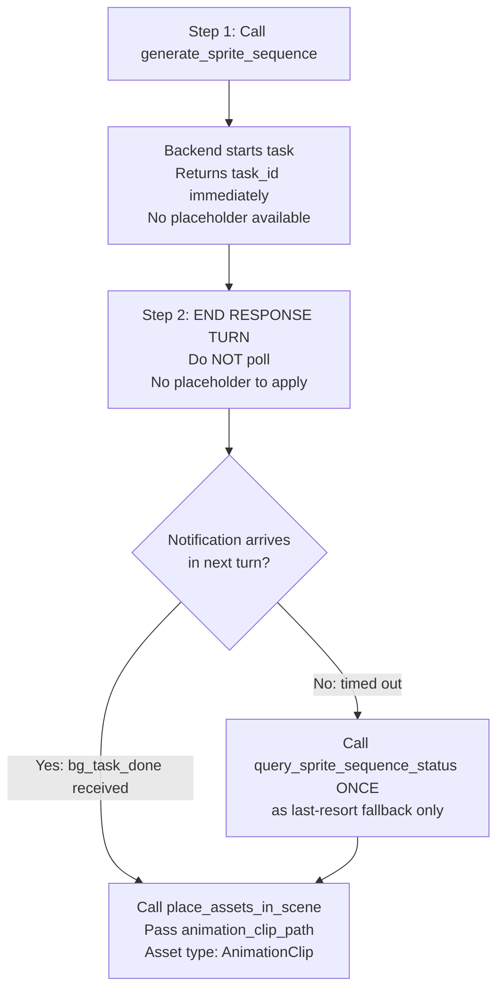

# Generate 2D Sprite Sequence Animation in Unity 🎬

Generate 2D sprite sequence animations in Unity using AI, from a character reference image.
Output: multiple **Sprite PNG frames** + one **AnimationClip (.anim)** that drives `SpriteRenderer.m_Sprite`, auto-saved to `Assets/TJGenerators/History/Sequence_yyyyMMdd_HHmmss/`.

Supports three animation types: idle (待机), frontRun (向前跑), backRun (向后跑). Configurable frame rate and loop settings.

## ⚡ CRITICAL: Async Workflow — Notification-Driven, No Polling

- **This API is fully asynchronous (~60–180 seconds). DO NOT block!**
- `generate_sprite_sequence` returns immediately with `task_id`.
- **🚫 POLLING IS STRICTLY FORBIDDEN.** Never call `query_sprite_sequence_status` in a loop or more than once.
  - ❌ Do NOT call `query_sprite_sequence_status` repeatedly
  - ❌ Do NOT loop or wait for status
  - ✅ End your response turn after starting generation
  - ✅ A `<bg_task_done>` notification arrives **automatically** in your next turn with all results
  - ✅ Use `query_sprite_sequence_status` **at most once**, only as a last-resort fallback if no notification arrives

## Recommended Workflow



**Key Points:**
- `generate_sprite_sequence` returns immediately with a `task_id`
- **⚠️ NO placeholder available** — unlike `generate_sprite` / `generate_material` / `generate_audio_clip`, this tool does NOT return a `placeholder_path`. There is no usable asset until generation completes.
- Generation runs in background (~60–180 seconds)
- **Maximum 5 concurrent tasks** — do not start more than 5 at once
- When `session_id=""` in a notification, it came from domain reload recovery — match by `task_id` or `backend_task_id` instead

**Recommended pattern:**
Since there's no placeholder, end your response turn after starting generation. When the `<bg_task_done>` notification arrives, call `place_assets_in_scene` with `animation_clip_path` — it automatically creates the scene structure (GameObject + SpriteRenderer + Animator) and binds the AnimationClip in one step.

```python
# Step 1: Start generation (returns task_id immediately, no placeholder)
result = execute_custom_tool(tool_name="generate_sprite_sequence",
    parameters={"image_path": "Assets/Characters/hero.png", "animation_type": "idle"})
task_id = result["task_id"]
```

**Step 2 — 生成完成后**
调用 `place_assets_in_scene` skill，传入 `animation_clip_path`（来自 `query_sprite_sequence_status` 的返回值）和 `asset_type: AnimationClip`。skill 会自动在场景中创建 GameObject + SpriteRenderer + Animator 并绑定 AnimationClip，无需提前手动建立结构。

## When to Use
- User wants to generate frame-by-frame 2D character animations
- User says "序列帧", "帧动画", "sprite animation", "frame animation", "动作帧", "待机动画", "跑步动画"
- User has a 2D character sprite and wants it animated (idle, run, etc.)
- User is building a 2D game and needs animated sprites for characters, enemies, or NPCs

## When NOT to Use
- User wants a static 2D icon or item image → use `unity-sprite-generation` skill
- User wants a 3D model → use `unity-3d-generation` skill
- User wants a skybox or environment → use `unity-skybox-generation` skill
- User wants background music or sound → use `unity-audio-clip-generation` skill
- User has NO reference image and cannot provide one (image_path is required)

## Tools

All tools are called via `execute_custom_tool`.

### generate_sprite_sequence
Start a sprite sequence generation task. **`image_path` is required.**

```bash
execute_custom_tool(
  tool_name="generate_sprite_sequence",
  parameters={
    "image_path": "Assets/Characters/hero.png",  # REQUIRED: character reference image
    "generator_id": "sprite_sequence_v1",         # Only available generator (default)
    "animation_type": "idle",                     # "idle" | "frontRun" | "backRun" (default "idle")
    "fps": 12,                                    # Frame rate for AnimationClip (1-60, default 12)
    "loop": True,                                 # Whether AnimationClip loops (default True)
  }
)
```

**Required:** `image_path` (absolute path or Assets-relative path to the character image)

**Returns (success):**
- `success`: `true`
- `task_id`: Identifier for status queries
- `animation_type`: Echoed back
- `fps` / `loop`: Echoed back
- `estimated_wait_seconds`: ~90 seconds
- `notification_mode`: `"bg_task_done"` — confirms automatic notification is supported

**Returns on submission failure:**
```json
{ "success": false, "error_code": "AUTH_REQUIRED", "message": "Not logged in. Open Window → Unity Connect and sign in." }
```
Check `result["success"]` before reading `task_id`. If `false`, report the error immediately and do NOT poll.

> Initial `progress` is always `0` on creation; use `query_sprite_sequence_status` to track real-time progress.

**Returns (error — e.g. missing `image_path`):**
- `success`: `false`
- `message`: Human-readable error description

### `<bg_task_done>` Notification (Primary)

When generation completes, a `<bg_task_done>` notification is automatically injected into your next turn. Its payload contains **all the same fields as `query_sprite_sequence_status`**:

| Field | Description |
|-------|-------------|
| `status` | `"completed"` or `"failed"` |
| `folder_path` | Parent folder containing all frame PNG files |
| `frame_count` | Number of generated sprite frames |
| `animation_clip_path` | Path to the `.anim` AnimationClip |
| `preview_url` | Preview URL or local file path (first frame) |
| `generator_id` | Generator used |
| `progress` | `100` when completed |
| `start_time` | Generation start timestamp |
| `end_time` | Generation end timestamp |
| `duration_seconds` | Total generation time |
| `error` | Error message (when `failed`) |

> Note: This tool is image-driven — there is no `prompt` field in the notification.

**If you receive this notification, the task is done. Do NOT call `query_sprite_sequence_status`.**

> `session_id` is empty string when notification comes from domain reload recovery path — match by `task_id` or `backend_task_id` instead.

### `query_sprite_sequence_status` — Fallback Only, Do NOT Poll

> ⚠️ **This tool is a last-resort fallback.** Only call it ONCE if no `<bg_task_done>` notification arrives after the estimated wait time. Never call it in a loop.

```bash
execute_custom_tool(
  tool_name="query_sprite_sequence_status",
  parameters={"task_id": "sprite_sequence_1_638..."}
)
```

**Returns:** Same fields as the `<bg_task_done>` notification payload above, plus:
- `success`: `true` (or `false` with `message` if `task_id` is missing or task not found)
- `progress`: Integer `0–100` — real-time progress percentage reported by the backend

### list_sprite_sequence_tasks
List all active and recent sprite sequence tasks.

```bash
execute_custom_tool(
  tool_name="list_sprite_sequence_tasks",
  parameters={}
)
```

**Returns:** `{ success: true, count: N, tasks: [...] }` — object with a `tasks` array of all tracked task objects.

## Animation Types

| `animation_type` | 中文 | Description |
|------------------|------|-------------|
| `idle` | 待机 | Character standing still with subtle motion — breathing, slight sway **(default)** |
| `frontRun` | 向前跑 | Character running toward the camera / forward direction |
| `backRun` | 向后跑 | Character running away from the camera / backward direction |

> These are the **only three valid values**. Any other value will fall back to `"idle"`.

## Output Assets

All outputs are saved to `Assets/TJGenerators/History/Sequence_yyyyMMdd_HHmmss/`:

| Asset | Description |
|-------|-------------|
| `frame_0001.png` … `frame_XXXX.png` | Individual Sprite frames, imported as `TextureImporterType.Sprite` |
| `Sequence_xxx.anim` | AnimationClip driving `SpriteRenderer.m_Sprite` with keyframed sprites |

The `animation_clip_path` in the status response points to the `.anim` file.
The `folder_path` is the parent directory containing both the frames and the clip.

## Usage Examples

### Generate an Idle Animation
```python
result = execute_custom_tool(
    tool_name="generate_sprite_sequence",
    parameters={
        "image_path": "Assets/Characters/warrior.png",
        "animation_type": "idle",
        "fps": 12,
        "loop": True
    }
)
task_id = result["task_id"]
# End response turn — bg_task_done notification arrives automatically with animation_clip_path
# Do NOT poll query_sprite_sequence_status
```

### Generate Run Animations Concurrently
```python
# ✅ Start both run animations at once — do NOT poll between them!
task_ids = []

for anim_type in ["frontRun", "backRun"]:
    result = execute_custom_tool(
        tool_name="generate_sprite_sequence",
        parameters={
            "image_path": "Assets/Characters/hero.png",
            "animation_type": anim_type,
            "fps": 24,
            "loop": True
        }
    )
    task_ids.append((anim_type, result["task_id"]))

# End response turn — bg_task_done notifications arrive automatically for each task
return f"Started {len(task_ids)} animations. Task IDs: {task_ids}"
```

### One-Shot Animation Set (All Three Types)
```python
# ✅ Fire-and-forget all three animation types at once
# Maximum 5 concurrent tasks at a time.

image = "Assets/Characters/goblin.png"
animation_types = ["idle", "frontRun", "backRun"]
task_ids = {}

for anim_type in animation_types:
    result = execute_custom_tool(
        tool_name="generate_sprite_sequence",
        parameters={
            "image_path": image,
            "animation_type": anim_type,
            "fps": 12,
            "loop": True
        }
    )
    task_ids[anim_type] = result["task_id"]

# End response turn — bg_task_done notifications arrive automatically. Do NOT poll.
return f"Started all 3 animations. Task IDs: {task_ids}"
```

## Parameters Quick Reference

| Parameter | Type | Default | Notes |
|-----------|------|---------|-------|
| `image_path` | string | **required** | Character reference image — PNG/JPG, clear subject, ideally transparent or simple background |
| `animation_type` | string | `"idle"` | `"idle"` \| `"frontRun"` \| `"backRun"` — only these three values |
| `fps` | int | `12` | AnimationClip frame rate (1–60). 12 suits most 2D games; 24 for smoother motion |
| `loop` | bool | `true` | Set `false` for one-shot animations (death, attack finish) |
| `generator_id` | string | `"sprite_sequence_v1"` | Only one generator available; omit unless testing |

### `fps` Decision Guide

| Use Case | Recommended FPS |
|----------|----------------|
| Classic pixel art / retro look | 8–12 |
| Smooth mobile character | 12–18 |
| High-quality animation | 24 |
| Very fast action / particle effect | 30+ |

### `loop` Decision Guide

| Animation | Loop |
|-----------|------|
| Idle, walk, run, hover | `true` (default) |
| Attack, jump (one-shot) | `false` |
| Death, celebrate (play once) | `false` |

## Troubleshooting

### `success: false` — "'image_path' is required for sprite sequence generation. Provide the path to a character reference image."
- `image_path` is **mandatory** — this tool only works with a reference image
- Provide the path to a character PNG or JPG in your project (or an absolute filesystem path)
- If the user doesn't have an image yet, suggest generating one with `unity-sprite-generation` first

### Task immediately fails after starting — image file not found
- The tool does not validate whether `image_path` exists before submitting the task
- If the path is wrong or the file is missing, the task starts (`status: "generating"`) but quickly transitions to `status: "failed"` with an error in `query_sprite_sequence_status`
- Always verify the file path is correct (Assets-relative or absolute) before calling

### `success: false` — "Cannot find sprite sequence generator config for 'sprite_sequence_v1'"
- Verify `cn.tuanjie.ai.generators` is installed in the Unity project
- Wait for Unity Editor to finish compiling after package install

### "Unknown animation_type" / falling back to idle
- Valid values are exactly: `"idle"`, `"frontRun"`, `"backRun"` (case-sensitive)
- Any other value silently falls back to `"idle"`

### Task stuck in "generating"
- Generation normally takes 60–180 seconds
- Check internet connection and Unity Editor is still open
- Use `list_sprite_sequence_tasks` to verify the task is tracked

### AnimationClip exists but character doesn't animate in-editor
- Ensure the `GameObject` has both a `SpriteRenderer` and an `Animator` component
- The Animator Controller must reference the `.anim` file as a state
- Click **Play** in the Editor — animations only play in Play Mode (or via the Animation preview panel)

### Frames look correct but timing is off
- Regenerate with a different `fps` value; try `fps: 8` for slower/smoother or `fps: 24` for faster
- Or adjust the clip speed in the Animator state's **Speed** field

---

`place_assets_in_scene` 用于把 `animation_clip_path` 放进场景，资产类型为 `AnimationClip`。生成完成后调用它即可；它会自动创建或补齐 GameObject、SpriteRenderer、Animator 和 AnimatorController，无需再写临时 `.cs` 文件。

---

**Task Lifecycle:**
1. Call `generate_sprite_sequence` with `image_path` → get `task_id` (returns immediately!)
2. End response turn — a `<bg_task_done>` notification arrives automatically with `animation_clip_path`
3. If no notification arrives, call `query_sprite_sequence_status` **once** as last-resort fallback only
4. When `status: "completed"` → call `place_assets_in_scene` with `animation_clip_path` and asset type `AnimationClip`; it creates or completes the `GameObject + SpriteRenderer + Animator + AnimatorController` setup
5. Tasks persist in memory until Unity Editor is restarted

**Status Values:** `generating` → `completed` | `failed`
**Task ID Format:** `sprite_sequence_{counter}_{timestamp}`

**Notes:**
- Async generation (Unity Editor must stay open during generation)
- **Maximum 5 concurrent tasks** — batch larger sets
- Frame PNGs are auto-imported as `TextureImporterType.Sprite`
- AnimationClip drives `SpriteRenderer.m_Sprite` property
- `TJGeneratorsAIGenerated` label applied automatically to all output assets
- Requires internet connection; may consume AI service credits
