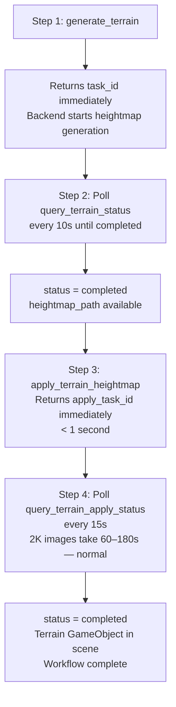

# Generate Unity Terrain 🏔️

Generate Unity Terrain assets from AI-generated grayscale heightmaps using the **Frontier** model, then automatically apply them to the current scene.

> **Model:** Frontier is the only supported model for terrain generation — there is no `generator_id` parameter. Aspect ratio is always `1:1` (square heightmap) and is not user-configurable.

Output: a **Unity Terrain GameObject** placed in the current scene, backed by a `TerrainData` asset and a processed heightmap PNG, all saved to `Assets/TJGenerators/History/`.

## When NOT to Use
- **3D model** (rock, tree, building) → use `unity-3d-generation`
- **Skybox / environment backdrop** → use `unity-skybox-generation`
- **General image / texture** → use `unity-image-generation`
- **Sprite** → use `unity-sprite-generation`

---

## ⚡ CRITICAL: Notification-Driven Workflow

- `generate_terrain` and `apply_terrain_heightmap` both support `<bg_task_done>` notifications.
- **🚫 Do NOT poll `query_terrain_status` or `query_terrain_apply_status` in a loop.**
  - ✅ A `<bg_task_done>` notification arrives **automatically** when each step completes
  - ✅ Use query tools **at most once** as a last-resort fallback if no notification arrives
- When `session_id=""` in a notification, it came from domain reload recovery — match by `task_id` or `apply_task_id` instead.

## ⚡ Default: Fully Automated Workflow

**The AI agent handles everything end-to-end.** When the user asks to generate terrain, automatically run all three steps without asking the user to do anything between them.



> **⚠️ WRONG (unless user explicitly asks): Fire-and-forget** — Starting generation and returning `task_id` without completing the workflow leaves the user waiting. Finish the job automatically.

> ⚠️ Only deviate from this auto-flow when the user explicitly says "only generate heightmap" or "let me apply it myself".

**When to use manual two-step mode** (deviate from full-auto ONLY when the user explicitly says):
- "只生成高度图，先不要放到场景里" / "generate heightmap only"
- "I'll apply the terrain myself later"
- "分步执行" / "let me control each step"
- User wants to inspect or adjust post-processing options before applying

> **CRITICAL:** `apply_terrain_heightmap` is **async** — it returns `apply_task_id` immediately. The actual terrain creation takes 10-60 seconds in the background. **Always poll `query_terrain_apply_status` to confirm completion.** Never retry `apply_terrain_heightmap` if you already got an `apply_task_id` — check the apply status instead.

---

## Tools

All tools are called via `execute_custom_tool`.

> To place an existing TerrainData asset (`.asset`) directly into the scene, or to adjust terrain position / add lighting after placement, use the `place_assets_in_scene` skill with the TerrainData asset path and asset type `TerrainData`. Unless the user explicitly requests it, do not write `.cs` files to disk.

### `generate_terrain`

Start an async AI heightmap generation task. Returns immediately with a `task_id`.

```python
result = execute_custom_tool(
    tool_name="generate_terrain",
    parameters={
        "prompt": "rugged mountain range with steep peaks and valleys",
        # Optional parameters:
        "image_path": "Assets/ref_heightmap.png",  # Reference image for shape guidance
        "resolution": "2K",  # "1K" / "2K" / "4K" (default "2K")
        # output_path: NOT recommended. Default saves to Assets/TJGenerators/History/.
    }
)
```

| Parameter | Type | Default | Description |
|-----------|------|---------|-------------|
| `prompt` | string | — | Terrain description (optional if `image_path` provided) |
| `image_path` | string | — | Reference image path (`Assets/...`) for shape guidance |
| `resolution` | string | `"2K"` | Output resolution: `"1K"` / `"2K"` / `"4K"` |
| `output_path` | string | — | Custom save path; omit to use default |

**Returns:**
- `task_id`: Identifier for status queries
- `placeholder_path`: 1×1 gray PNG placeholder (available immediately)
- `backend_task_id`: Backend task identifier
- `status`: `"submitted"`
- `estimated_wait_seconds`: ~60 seconds
- `notification_mode`: `"bg_task_done"` — confirms automatic notification is supported

**Returns on failure:**
```json
{ "success": false, "error_code": "AUTH_REQUIRED", "message": "Not logged in. Open Window → Unity Connect and sign in." }
```
Check `result["success"]` before reading `task_id`. If `false`, report the error immediately.

---

### `<bg_task_done>` Notification for `generate_terrain` (Primary)

When heightmap generation completes, a `<bg_task_done>` notification is automatically injected into your next turn:

| Field | Description |
|-------|-------------|
| `status` | `"completed"` or `"failed"` |
| `heightmap_path` | Generated heightmap PNG path |
| `preview_url` | Preview URL or local file path |
| `prompt` | Original prompt |
| `progress` | `100` when completed |
| `start_time` | Generation start timestamp |
| `end_time` | Generation end timestamp |
| `duration_seconds` | Total generation time |
| `error` | Error message (when `failed`) |

**If you receive this notification, call `apply_terrain_heightmap` next. Do NOT call `query_terrain_status`.**

> `session_id` is empty string when notification comes from domain reload recovery path — match by `task_id` or `backend_task_id` instead.

### `query_terrain_status` — Fallback Only, Do NOT Poll

> ⚠️ **This tool is a last-resort fallback.** Only call it ONCE if no `<bg_task_done>` notification arrives. Never call it in a loop.

```python
status = execute_custom_tool(
    tool_name="query_terrain_status",
    parameters={"task_id": "terrain_1_638..."}
)
```

**Returns when completed:**
```json
{
  "success": true,
  "task_id": "terrain_1_...",
  "status": "completed",
  "heightmap_path": "Assets/TJGenerators/History/Terrain_xxx.png",
  "preview_url": "...",
  "duration_seconds": 45,
  "next_step": "Call apply_terrain_heightmap with this heightmap_path to create a Unity Terrain."
}
```

**Returns when generating:**
```json
{
  "success": true,
  "status": "generating",
  "placeholder_path": "Assets/TJGenerators/History/Terrain_xxx.png",
  "next_poll_recommended_after_seconds": 10
}
```

#### Status meanings

| Status | Meaning |
|--------|---------|
| `generating` | Backend is processing — keep polling |
| `completed` | Done — `heightmap_path` is ready; call `apply_terrain_heightmap` once then stop |
| `applied` | Terrain already placed in scene — do NOT call `apply_terrain_heightmap` again |
| `failed` | Generation failed — see `error_message` field |
| `interrupted` | Unity Editor lost track — re-generate |

> **Important:** Use `heightmap_path` (not `placeholder_path`) when calling `apply_terrain_heightmap`. The placeholder is only a 1×1 stub; `heightmap_path` is the real generated PNG.

---

### `apply_terrain_heightmap`

Convert a heightmap PNG to a Unity Terrain in the current scene. This is a **synchronous local operation** — no network call, completes in under 1 second.

```python
# Returns IMMEDIATELY with apply_task_id — then poll query_terrain_apply_status
apply_result = execute_custom_tool(
    tool_name="apply_terrain_heightmap",
    parameters={
        "heightmap_path": "Assets/TJGenerators/History/Terrain_xxx.png",
        "task_id": task_id,            # STRONGLY RECOMMENDED — prevents duplicate terrain
        # Optional — defaults shown:
        "use_default_options": True,   # True = best for most cases; ignores all params below
        "terrain_go_name": "TJGenerators Terrain",
        # Advanced post-processing (only when use_default_options=False):
        # "median3x3": True,
        # "gaussian_blur": True,
        # "gaussian_sigma": 1.2,
        # "bilateral_filter": True,
        # "bilateral_sigma_space": 3.0,
        # "bilateral_sigma_color": 0.2,
        # "thermal_erosion": True,
        # "thermal_erosion_iterations": 25,
        # "thermal_erosion_talus": 0.02,
        # "percentile_normalize": True,
        # "percentile_low": 0.05,
        # "percentile_high": 0.95,
        # "height_gamma": 1.0,
        # "remap_output_min": 0.02,
        # "remap_output_max": 0.98,
    }
)
```

| Parameter | Type | Default | Description |
|-----------|------|---------|-------------|
| `heightmap_path` | string | **required** | PNG path from `query_terrain_status.heightmap_path` |
| `task_id` | string | strongly recommended | Pass the `task_id` from `generate_terrain`. Enables duplicate-creation guard — if already applied, returns immediately without creating another Terrain. |
| `session_id` | string | `""` | Associates generated assets with a session for tracking |
| `use_default_options` | bool | `true` | `true` = apply recommended post-processing (median + bilateral + thermal erosion + percentile normalize). Set `false` to tune manually. |
| `terrain_go_name` | string | `"TJGenerators Terrain"` | Name for the created GameObject |
| `median3x3` | bool | `true` | Median filter (noise removal) |
| `gaussian_blur` | bool | `true` | Gaussian smoothing (non-edge-preserving) |
| `gaussian_sigma` | float | `1.2` | Gaussian sigma; effective only when `bilateral_filter=false` |
| `bilateral_filter` | bool | `true` | Edge-preserving smoothing (takes priority over gaussian) |
| `bilateral_sigma_space` | float | `3.0` | Bilateral spatial sigma |
| `bilateral_sigma_color` | float | `0.2` | Bilateral color sigma (smaller = sharper edges) |
| `thermal_erosion` | bool | `true` | Simulates natural erosion |
| `thermal_erosion_iterations` | int | `25` | More iterations = smoother terrain |
| `thermal_erosion_talus` | float | `0.02` | Talus angle; smaller = more aggressive slope reduction |
| `percentile_normalize` | bool | `true` | Stretches contrast using low/high percentiles |
| `percentile_low` | float | `0.05` | Lower clamp percentile |
| `percentile_high` | float | `0.95` | Upper clamp percentile |
| `height_gamma` | float | `1.0` | < 1.0 = more mountains; > 1.0 = flatter |
| `remap_output_min` | float | `0.02` | Raise to lift "sea level" |
| `remap_output_max` | float | `0.98` | Lower to flatten peak heights |

**Returns immediately (< 1s):**
```json
{
  "success": true,
  "apply_task_id": "terrain_apply_1_...",
  "status": "processing",
  "message": "Post-processing started in background. 2K image may take 60-180s. Poll query_terrain_apply_status every 15s. Do NOT retry apply_terrain_heightmap.",
  "estimated_seconds": 90,
  "next_poll_after_seconds": 15,
  "max_wait_before_retry_seconds": 300
}
```

**If task_id was already applied (idempotency guard):**
```json
{
  "success": true,
  "already_applied": true,
  "terrain_data_path": "...",
  "terrain_go_name": "...",
  "message": "Terrain already applied. WORKFLOW COMPLETE."
}
```

---

### `<bg_task_done>` Notification for `apply_terrain_heightmap` (Primary)

When terrain apply completes, a `<bg_task_done>` notification is automatically injected into your next turn:

| Field | Description |
|-------|-------------|
| `status` | `"completed"` or `"failed"` |
| `heightmap_path` | The heightmap PNG that was applied |
| `terrain_data_path` | Generated TerrainData asset path |
| `terrain_go_name` | Name of the Terrain GameObject in scene |
| `progress` | `100` when completed |
| `error` | Error message (when `failed`) |

**If you receive this notification, the terrain workflow is complete. Do NOT call `query_terrain_apply_status`.**

> `session_id` is empty string when notification comes from domain reload recovery path — match by `apply_task_id` instead.

### `query_terrain_apply_status` — Fallback Only, Do NOT Poll

> ⚠️ **This tool is a last-resort fallback.** Only call it ONCE if no `<bg_task_done>` notification arrives. Never call it in a loop.

```python
status = execute_custom_tool(
    tool_name="query_terrain_apply_status",
    parameters={"apply_task_id": "terrain_apply_1_..."}
)
```

**Returns when completed:**
```json
{
  "success": true,
  "status": "completed",
  "terrain_data_path": "Assets/TJGenerators/History/Terrain_xxx_processed_TerrainData.asset",
  "terrain_go_name": "TJGenerators Terrain",
  "message": "Terrain is in the scene. WORKFLOW COMPLETE."
}
```

**Returns when processing:**
```json
{
  "success": true,
  "status": "processing",
  "elapsed_seconds": 45,
  "next_poll_after_seconds": 15,
  "message": "Background post-processing is running (45s elapsed). 2K images take 60-180s — this is normal. Do NOT retry apply_terrain_heightmap. Poll again in 15s. Only consider it stuck if elapsed_seconds > 300."
}
```

#### Status meanings

| Status | Meaning |
|--------|---------|
| `processing` | Background filtering running — poll again in 15s. **Normal: 2K images take 60–180s.** |
| `completed` | Terrain is in scene — **stop polling, workflow done** |
| `failed` | Post-processing failed — may retry with `apply_terrain_heightmap` |

> **CRITICAL — Do NOT retry early:** `elapsed_seconds` tells you how long the background task has been running. A 2K heightmap (bilateral filter + thermal erosion) typically takes **60–180 seconds**. If `status == "processing"` and `elapsed_seconds < 300`, keep polling — do **NOT** call `apply_terrain_heightmap` again. Only retry if `status == "failed"` or `elapsed_seconds > 300`.

---

### `list_terrain_tasks`

List all active and recent terrain generation tasks in the current Editor session.

```python
result = execute_custom_tool(tool_name="list_terrain_tasks", parameters={})
# Returns: { "success": true, "count": N, "tasks": [...] }
```

---

## Usage Examples

### ### Unified: Text Prompt / Reference Image + Optional Post-Processing

```python
import time

# Configuration
prompt = "tropical island with central mountain peak, flat coastal ring"
image_path = "Assets/Reference/island_shape.png"   # Optional: set None to disable
resolution = "2K"                                  # Optional: "1K", "2K"

use_custom_postprocess = True                      # Optional: Custom Post-Processing
postprocess_options = {
    "height_gamma": 0.8,
    "remap_output_min": 0.05,
    "thermal_erosion": True,
    "thermal_erosion_iterations": 20,
    "terrain_go_name": "Island Terrain"
}

# Step 1: Start generation
parameters = {
    "prompt": prompt
}

if image_path:
    parameters["image_path"] = image_path
if resolution:
    parameters["resolution"] = resolution

result = execute_custom_tool(
    tool_name="generate_terrain",
    parameters=parameters
)

if not result.get("success", True):
    raise RuntimeError(f"[{result['error_code']}] {result['message']}")

task_id = result["task_id"]
time.sleep(result.get("recommended_first_poll_after_seconds", 5))

# Step 2: Poll until completed
while True:
    status = execute_custom_tool(
        tool_name="query_terrain_status",
        parameters={"task_id": task_id}
    )
    if status["status"] == "completed":
        break
    elif status["status"] == "failed":
        raise RuntimeError(f"Terrain generation failed: {status.get('error_message')}")
    time.sleep(status.get("next_poll_recommended_after_seconds", 10))

# Step 3: Apply terrain - Start async post-processing (returns IMMEDIATELY with apply_task_id)
apply_params = {
    "heightmap_path": status["heightmap_path"],
    "task_id": task_id
}

if use_custom_postprocess:
    apply_params.update({
        "use_default_options": False,
        **postprocess_options
    })

apply_result = execute_custom_tool(
    tool_name="apply_terrain_heightmap",
    parameters=apply_params
)

apply_task_id = apply_result["apply_task_id"]
time.sleep(apply_result.get("next_poll_after_seconds", 15))

# Step 4: Poll until terrain is placed in scene
# 2K images take 60-180s — use elapsed_seconds to decide if stuck (only retry if > 300s)
while True:
    apply_status = execute_custom_tool(
        tool_name="query_terrain_apply_status",
        parameters={"apply_task_id": apply_task_id}
    )
    if apply_status["status"] == "completed":
        break
    elif apply_status["status"] == "failed":
        raise RuntimeError(f"Terrain apply failed: {apply_status.get('error')}")
    # Do NOT retry apply_terrain_heightmap while processing — keep polling
    time.sleep(apply_status.get("next_poll_after_seconds", 15))

print(f"Terrain ready: {apply_status['terrain_go_name']} ({apply_status['terrain_data_path']})")
```

### Concurrent Generation (Multiple Terrain Variants — Max 5)

```python
import time

terrain_prompts = [
    "rugged mountain range with snow-capped peaks",
    "gently rolling grassy plains with river valley",
    "volcanic island with caldera, steep outer slopes",
]

# Fire all requests concurrently
tasks = []
for prompt in terrain_prompts:
    result = execute_custom_tool(
        tool_name="generate_terrain",
        parameters={"prompt": prompt}
    )
    tasks.append(result["task_id"])
    # Do NOT wait — fire all immediately

# Poll all until all complete, then apply each
# (Poll in a loop across all task_ids, apply each as it completes)
```

### Manual Mode (Only When User Explicitly Requests It)

```python
# User said: "只生成高度图，我之后自己决定是否放到场景里"

result = execute_custom_tool(
    tool_name="generate_terrain",
    parameters={"prompt": "rolling hills with gentle valleys"}
)
# Return task_id to user without auto-applying
print(f"Heightmap generation started. task_id={result['task_id']}")
print(f"When ready, call apply_terrain_heightmap with the heightmap_path from query_terrain_status.")
```

---

## Prompt Writing Guide

| Terrain Type | Recommended Prompt |
|---|---|
| Mountains | `"rugged mountain range with steep peaks and deep valleys, gradual foothills"` |
| Rolling Hills | `"gently rolling grassy plains with subtle elevation changes and smooth curves"` |
| Island | `"tropical island with central mountain peak, flat coastal area, gradual slopes"` |
| Canyon | `"deep canyon with layered rock formations, wide rim, narrow river valley at bottom"` |
| Volcano | `"dormant volcano with central caldera, smooth sloped sides, flat ash plains"` |
| Desert Dunes | `"sand dunes with smooth flowing curves, gradual ridges, no sharp edges"` |
| Coastal Cliffs | `"coastal terrain with high cliffs on one side, gradual inland slope"` |

**Tips:**
- **Avoid** describing vegetation, buildings, or trees — they become unexpected height bumps
- **Add** "smooth", "gradual", "gentle" for natural-looking transitions
- **Reference image** (`image_path`) significantly improves terrain shape accuracy
- Use `"top-down orthographic view"` in the prompt to hint the model toward a heightmap-style output
- For flat areas: add `"large flat areas"`, `"minimal relief"`, `"subtle elevation"`

---

## Post-Processing Guide

| Scenario | Recommended Settings |
|---|---|
| General use (most cases) | `use_default_options=true` (median + bilateral + thermal erosion + percentile normalize) |
| More dramatic mountains | `height_gamma=0.8` (boosts high areas) |
| Flatter, more plains-like | `height_gamma=1.2` (compresses high areas) |
| Raise sea level / base height | `remap_output_min=0.05` |
| Limit maximum peak height | `remap_output_max=0.85` |
| Smoother erosion | Increase `thermal_erosion_iterations` to 25–30 |
| Preserve sharp ridges | `bilateral_filter=false`, `thermal_erosion=false` |

---

## Troubleshooting

| Problem | Cause | Solution |
|---|---|---|
| Multiple Terrain objects / many `_processed N` assets created | `apply_terrain_heightmap` was retried after timeout (pre-fix). Now fixed: tool returns async `apply_task_id` in < 1s, eliminating timeout. | Upgrade to latest package version. If it recurs, check `apply_task_id` via `query_terrain_apply_status` before retrying. |
| Terrain has vertical walls around the edges | AI image edge pixels are anomalous; feathering insufficient | Use `use_default_options=true` (includes edge feathering) |
| Terrain is completely flat | PNG is not grayscale or normalization failed | Confirm `query_terrain_status` returns `completed` before calling `apply_terrain_heightmap` |
| `apply_terrain_heightmap` reports "file not found" | Used `placeholder_path` instead of `heightmap_path` | Wait for `status=completed`, then use `status["heightmap_path"]` |
| Frontier config not found | TJGenerators package not installed or config cache stale | Run **AI生成/清除配置缓存并重新加载** in Unity |
| Generation stuck at `generating` for >5 minutes | Network issue or backend overload | Check internet; use `list_terrain_tasks` to verify task is tracked |
| Task not found after querying | Unity Editor was restarted (tasks are session-scoped) | Re-generate with the same prompt |

---

## Task Lifecycle

**`generate_terrain` status values:** `generating` → `completed` | `applied` | `failed` | `interrupted`
**Apply status values:** `processing` → `completed` | `failed`
**Task ID formats:** `terrain_{counter}_{timestamp}` (generation), `terrain_apply_{counter}_{timestamp}` (apply)

**Notes:**
- Async heightmap generation requires Unity Editor to stay open (~30–90 seconds)
- `apply_terrain_heightmap` returns immediately; post-processing takes **60–180s** for 2K images in background thread. Poll every 15s. Do NOT retry until `elapsed_seconds > 300` or `status == "failed"`.
- The background thread timeout was the root cause of duplicate terrain creation — now fixed
- TerrainData asset and processed PNG are saved to `Assets/TJGenerators/History/`
- The Terrain GameObject is automatically selected in the scene after creation
- Generation tasks persist across domain reload (session storage); apply tasks are memory-only
- **Maximum 5 concurrent generation tasks**
