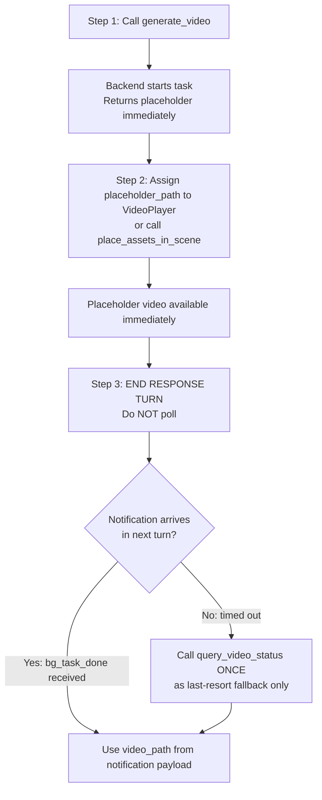

# Generate Video in Unity 🎬

Generate **video assets** in Unity using AI, from text descriptions or reference images.
Output: video file auto-imported as **VideoClip**, saved to `Assets/Video/`.

> **🎬 Text-to-Video & Image-to-Video.** This tool supports both modes: generate videos from text descriptions alone, or use a reference image as the starting point.

## ⚠️ CRITICAL: Prompt Language Requirement

**The `prompt` parameter MUST be written in English.** The video generation API only supports English text descriptions.

- ✅ `"a majestic dragon flying over a medieval castle, cinematic lighting, 4K quality"`
- ✅ `"slow motion water droplet falling into a pool, detailed splash, macro lens"`
- ❌ `"一条巨龙飞越中世纪城堡，电影级光效"` — Chinese prompts will NOT work correctly

**If the user provides a Chinese description, translate it to English before calling `generate_video`.**

---

## ⚡ CRITICAL: Async Workflow — Notification-Driven, No Polling

- **This API is fully asynchronous (~30–120 seconds). DO NOT block!**
- `generate_video` returns immediately with `task_id` and `placeholder_path`.
- **🚫 POLLING IS STRICTLY FORBIDDEN.** Never call `query_video_status` in a loop or more than once.
  - ❌ Do NOT call `query_video_status` repeatedly
  - ❌ Do NOT loop or wait for status
  - ✅ Apply the placeholder immediately, then **end your response turn**
  - ✅ A `<bg_task_done>` notification arrives **automatically** in your next turn with all results
  - ✅ Use `query_video_status` **at most once**, only as a last-resort fallback if no notification arrives

## Recommended Workflow



**Key Points:**
- `generate_video` returns immediately with a `task_id` **and a usable `placeholder_path`**
- The placeholder video is available immediately — assign it to a VideoPlayer right away
- Generation runs in background (~30–120 seconds); placeholder overwritten in-place when done
- When `session_id=""` in a notification, it came from domain reload recovery — match by `task_id` or `backend_task_id` instead

## When to Use
- User wants to generate a **video asset** for cinematic sequences, backgrounds, or visual effects
- User says "视频", "视频片段", "视频生成", "转场视频", "宣传视频", "transition video", "promotional video", "video", "video clip", "animation video", "motion video"
- User wants animated content for intro/outro sequences, cutscenes, background videos, transition effects, or promotional content
- User needs concept videos, motion graphics, or promotional videos for visualization
- **User wants to generate transition/promotional videos based on their Unity scene content** — e.g., "根据场景内容生成转场视频", "从当前场景生成宣传视频", "capture scene and make transition video", "generate promotional video from scene"

## When NOT to Use
- User wants a 3D model → use `unity-3d-generation` skill
- User wants a 2D sprite → use `unity-sprite-generation` skill
- User wants a sprite sequence animation → use `unity-sprite-sequence-generation` skill
- User wants background music or audio → use `unity-audio-clip-generation` or `unity-sound-effect-generation` skill
- User wants to edit or process existing video files (this tool only generates new videos)

## Tools

All tools are called via `execute_custom_tool`.

### generate_video
Start a video generation task.

```bash
execute_custom_tool(
  tool_name="generate_video",
  parameters={
    "prompt": "a majestic dragon flying over a medieval castle, cinematic lighting",  # Required
    "mode": "text_to_video",     # Optional: "text_to_video" or "reference_image", default "reference_image"
    "resolution": "720p",        # Optional: "480p" or "720p", default "720p"
    "ratio": "16:9",             # Optional: "16:9", "9:16", or "1:1", default "16:9"
    "duration": 12,              # Optional: int, 3-15 seconds, default 12
    "return_last_frame": True,   # Optional: bool, return last frame as preview, default True
    "image_path": "",            # Optional: string, reference image path for image-to-video mode
    # output_path: NOT recommended. Default saves to Assets/Video/ which is correct.
    # Only specify output_path if user explicitly requests a custom save location.
  }
)
```

> **⚠️ Do NOT specify `output_path` unless the user explicitly requests it.** The default save path `Assets/Video/` is the standard location for all generated assets.

**Required:** `prompt` — describe the video content (what happens, visual style, camera movement, atmosphere)
**Optional:** `image_path` — path to a reference image for image-to-video mode (when `mode="reference_image"`)

**Returns:**
- `task_id`: Identifier for status queries
- `placeholder_path`: Video placeholder asset path — **available immediately**, assign to VideoPlayer right away
- `estimated_wait_seconds`: ~60 seconds
- `notification_mode`: `"bg_task_done"` — confirms automatic notification is supported

**Returns on submission failure:**
```json
{ "success": false, "error_code": "AUTH_REQUIRED", "message": "Not logged in. Open Window → Unity Connect and sign in." }
```
Check `result["success"]` before reading `task_id`. If `false`, report the error immediately and do NOT poll.

> **Placeholder workflow:** `placeholder_path` is a minimal placeholder video created at the start. Assign it to a VideoPlayer immediately. When generation completes, the file is overwritten in-place with the real video — no manual reassignment needed.

### `<bg_task_done>` Notification (Primary)

When generation completes, a `<bg_task_done>` notification is automatically injected into your next turn. Its payload contains **all the same fields as `query_video_status`**:

| Field | Description |
|-------|-------------|
| `status` | `"completed"` or `"failed"` |
| `video_path` | Final VideoClip asset path |
| `preview_url` | Preview URL or local file path |
| `last_frame_url` | Last frame preview image URL (may be empty) |
| `generator_id` | Generator used |
| `prompt` | Original prompt |
| `progress` | `100` when completed |
| `start_time` | Generation start timestamp |
| `end_time` | Generation end timestamp |
| `duration_seconds` | Total generation time |
| `error` | Error message (when `failed`) |

**If you receive this notification, the task is done. Do NOT call `query_video_status`.**

> `session_id` is empty string when notification comes from domain reload recovery path — match by `task_id` or `backend_task_id` instead.

### `query_video_status` — Fallback Only, Do NOT Poll

> ⚠️ **This tool is a last-resort fallback.** Only call it ONCE if no `<bg_task_done>` notification arrives after the estimated wait time. Never call it in a loop.

```bash
execute_custom_tool(
  tool_name="query_video_status",
  parameters={"task_id": "video_1_638..."}
)
```

**Returns:** Same fields as the `<bg_task_done>` notification payload above, plus:
- `placeholder_path`: Placeholder video path *(only present when `generating`)*

### list_video_tasks
List all active and recent video tasks.

```bash
execute_custom_tool(
  tool_name="list_video_tasks",
  parameters={}
)
```

**Returns:** `{ success: true, count: N, tasks: [...] }` — object with a `tasks` array of all tracked video task objects.

## Generator Parameters

### mode (string, default: "reference_image")
Generation mode for the video.
- `"text_to_video"`: Generate video from text description only
- `"reference_image"`: Generate video from a reference image (image-to-video)

**Note:** If `image_path` is provided, mode automatically switches to `"reference_image"`.

### resolution (string, default: "720p")
Video resolution for output.
- `"480p"`: 854×480 (faster generation)
- `"720p"`: 1280×720 (higher quality)

### ratio (string, default: "16:9")
Video aspect ratio.
- `"16:9"`: Widescreen (landscape)
- `"9:16"`: Portrait (mobile vertical)
- `"1:1"`: Square

**⚠️ IMPORTANT:** When using a screenshot as the reference image (scene-to-video workflow), the ratio MUST match the screenshot's aspect ratio. Always check the screenshot dimensions before generating:
- If screenshot is 1280×720 → use `"16:9"`
- If screenshot is 720×1280 → use `"9:16"`
- If screenshot is 1024×1024 → use `"1:1"`

### duration (int, 3–15, default: 12)
Length of the video in seconds.
- Short clips (logo animations, transitions): 3–5 seconds
- Medium clips (motion graphics, loops): 6–10 seconds
- Long clips (cinematic sequences): 11–15 seconds

### return_last_frame (bool, default: true)
Whether to return the last frame of the video as a preview image.
Useful for thumbnails or previewing the final state before the full video is ready.

### image_path (string, optional)
Path to a reference image for image-to-video generation.
Only used when `mode="reference_image"`. The video will animate based on this image.

## Usage Examples

### Text-to-Video Generation
```python
result = execute_custom_tool(
    tool_name="generate_video",
    parameters={
        "prompt": "a majestic dragon flying over a medieval castle, cinematic lighting, 4K quality",
        "mode": "text_to_video",
        "resolution": "720p",
        "duration": 12
    }
)
task_id = result["task_id"]
placeholder_path = result["placeholder_path"]  # Video available immediately
# → {"success": true, "task_id": "video_1_...",
#    "placeholder_path": "Assets/Video/Video_20260304_120000.mp4"}

# ✅ Assign placeholder to VideoPlayer immediately, then end response turn
# ✅ bg_task_done notification arrives automatically — do NOT poll
```

### Image-to-Video Generation
```python
result = execute_custom_tool(
    tool_name="generate_video",
    parameters={
        "prompt": "gentle wind blowing through the trees, peaceful atmosphere",
        "image_path": "Assets/Textures/forest_landscape.png",
        "mode": "reference_image",
        "duration": 12
    }
)
```

### Portrait Video for Mobile
```python
result = execute_custom_tool(
    tool_name="generate_video",
    parameters={
        "prompt": "a character walking towards the camera, sunny day",
        "mode": "text_to_video",
        "ratio": "9:16",
        "resolution": "720p",
        "duration": 12
    }
)
```

### Square Video for Social Media
```python
result = execute_custom_tool(
    tool_name="generate_video",
    parameters={
        "prompt": "product showcase, rotating 360 degrees, clean background",
        "mode": "text_to_video",
        "ratio": "1:1",
        "duration": 12
    }
)
```

### Starting Generation and Responding
```python
result = execute_custom_tool(
    tool_name="generate_video",
    parameters={
        "prompt": "slow motion water droplet falling into a pool, detailed splash",
        "mode": "text_to_video",
        "resolution": "720p",
        "duration": 12
    }
)
if not result.get("success", True):
    raise RuntimeError(f"[{result['error_code']}] {result['message']}")
task_id = result["task_id"]
placeholder_path = result["placeholder_path"]

# Assign placeholder to VideoPlayer, then end response turn
# bg_task_done notification will arrive automatically — do NOT poll query_video_status
```

## Prompt Writing Guide

Write prompts that describe **the subject, action, visual style, camera movement, and atmosphere** of the video:

| Video Type | Example Prompt |
|------------|----------------|
| Cinematic | "epic dragon flying over medieval castle, dramatic clouds, slow motion, cinematic lighting" |
| Nature | "gentle waves crashing on beach at sunset, peaceful atmosphere, golden hour light" |
| Product | "360-degree product rotation, clean white background, professional studio lighting" |
| Character | "character walking slowly towards camera through fog, mysterious atmosphere" |
| Abstract | "colorful particles swirling and morphing, vibrant colors, smooth motion" |
| Logo animation | "logo appearing with particle explosion, smooth fade in, modern style" |
| Urban | "cityscape timelapse, day to night transition, buildings lighting up" |
| Fantasy | "magical portal opening with glowing particles, mystical atmosphere" |
| Transition video | "smooth wipe transition from left to right, blur effect, professional style" |
| Transition video | "particle dissolve transition, glowing particles fading in and out, elegant" |
| Promotional video | "product showcase with dynamic camera movement, sleek modern style, commercial quality" |
| Promotional video | "brand reveal animation, bold typography, energetic motion graphics, promotional" |

**Tips:**
- Describe the **main subject**: dragon, character, product, waves, particles
- Define the **action**: flying, crashing, rotating, walking, swirling
- Specify **visual style**: cinematic, peaceful, professional, mysterious, modern
- Add **camera movement**: slow motion, 360-degree rotation, pan, zoom
- Include **lighting/atmosphere**: golden hour, dramatic, mysterious, vibrant
- Mention **duration feel**: quick flash, smooth flow, slow reveal

## Using the VideoClip in Unity

### Recommended: Placeholder Workflow (Non-Blocking)

After calling `generate_video`, assign the placeholder immediately:

```csharp
// Assign placeholder video right away — keeps development moving
string placeholderPath = result["placeholder_path"];

VideoClip clip = AssetDatabase.LoadAssetAtPath<VideoClip>(placeholderPath);
VideoPlayer player = videoObject.GetComponent<VideoPlayer>();
player.clip = clip;
// player.Play();  // Optional: test playback

// When generation completes, the tool automatically updates all VideoPlayers
// in the scene that reference the placeholder to the real video file.
// No manual reassignment needed.
```

### VideoPlayer Settings for Generated Videos

For most generated video clips, configure the VideoPlayer as:
- `Loop: true` (for background loops, motion graphics)
- `Loop: false` (for one-time cinematic sequences)
- `Play On Awake: false` (trigger via script or animation event)
- `Render Mode: Camera Far Plane` or `Render Mode: Material Override` for display
- `Audio Output Mode: Audio Source` if the video has audio

## Troubleshooting

### "Cannot find generator config for 'huoshan-seedance'"
                                                                                                                                                                                                                                                                                The TJGenerators package is not installed or the config hasn't loaded. Check:
- `cn.tuanjie.ai.generators` is in `Packages/manifest.json`
- Unity Editor has finished compiling

### Task lost after domain reload (task_id no longer valid)
Unity domain reloads (script recompile, entering Play Mode) can clear in-memory task state. If `query_video_status` returns an error or the task is gone:
1. Check `Assets/Video/` for the expected file by name or timestamp
2. **Compare file sizes** — the placeholder video is a minimal stub; the real generated file will be significantly larger
3. If a larger video file exists at the expected path, generation has completed — use it directly as a VideoClip
4. If only the small placeholder remains, generation may still be in progress in the backend (Unity just lost the handle). Wait and re-check, or restart generation.

### Task stuck in "generating"
- Normal generation time is 30–120 seconds
- Higher resolution (`720p`) and longer `duration` take more time
- Check internet connection
- Use `list_video_tasks` to verify the task exists

### Video doesn't match prompt
- Be more specific about the subject, action, and visual style
- Include camera movement and lighting details
- Simplify the prompt — one clear concept per generation
- Adjust `duration` to match the expected motion

### VideoClip import issues in Unity
- Right-click the asset in the Project window → Reimport
- Check that the video file exists at `video_path`
- Verify the video format is supported by Unity (MP4, WebM, etc.)

### Image-to-video not working with provided image
- Ensure `image_path` points to a valid image asset in the Unity project
- Check that the image is accessible and not corrupted
- Verify `mode` is set to `"reference_image"` when using an image

---

## Scene-to-Video Workflow 🎬

Generate **videos directly from your Unity scene** by capturing the current scene state and using it as the reference image for AI video generation. This workflow supports two main use cases:

### Use Cases

1. **Transition Videos (转场视频)**: Create cinematic transitions between scenes using your actual game visuals
2. **Promotional Videos (宣传视频)**: Generate promotional content showcasing your game scenes with dynamic effects

Both workflows follow the same 7-step process, differing primarily in the prompt and VideoPlayer configuration.

### Workflow Overview

```
┌─────────────────────────────────────────────────────────────────┐
│  1. Enter Play Mode                                              │
│     → Scene runs and renders                                    │
│                                                                  │
│  2. Capture Game View Screenshot                                 │
│     → Saves to screenshots/ folder                              │
│                                                                  │
│  3. Exit Play Mode                                               │
│     → Returns to Editor state                                   │
│                                                                  │
│  4. Generate Video from Screenshot                              │
│     → Uses screenshot as reference image                        │
│     → AI creates transition effect                              │
│                                                                  │
│  5. Create & Configure VideoPlayer                               │
│     → Assign placeholder video immediately                      │
│     → Configure for transition (one-shot, camera far plane)      │
│                                                                  │
│  6. Poll for Completion (optional, when user asks)             │
│     → Check if real video is ready                              │
│     → Update VideoPlayer with final clip                        │
│                                                                  │
│  7. Save Scene                                                   │
│     → Preserve all changes                                      │
└─────────────────────────────────────────────────────────────────┘
```

### Complete Example

```python
# Step 1: Enter Play Mode to capture the scene
unity_editor(action="play")

# Step 2: Capture Game View screenshot
screenshot_result = unity_screenshot(
    action="capture_game_view",
    filename="scene_capture_for_video"
)
screenshot_path = screenshot_result["path"]  # e.g., "screenshots/scene_capture_for_video.png"

# Step 3: Exit Play Mode
unity_editor(action="stop")

# Step 4: Generate transition video from the screenshot
video_result = execute_custom_tool(
    tool_name="generate_video",
    parameters={
        "prompt": "Cinematic scene transition effect with smooth camera push-in, dramatic lighting shifts, particle dissolves and lens flares, creating an immersive transition between game scenes with elegant motion blur and atmospheric depth",
        "mode": "reference_image",
        "image_path": screenshot_path,
        "duration": 12,
        "ratio": "16:9",
        "resolution": "720p"
    }
)

if not video_result.get("success", True):
    raise RuntimeError(f"Video generation failed: {video_result.get('message')}")

task_id = video_result["task_id"]
placeholder_path = video_result["placeholder_path"]

# Step 5: Create VideoPlayer GameObject
video_player_go = unity_gameobject(
    action="create",
    name="TransitionVideoPlayer",
    position=[0, 0, 0]
)

# Step 6: Configure VideoPlayer with placeholder
execute_csharp_script(f"""
var go = GameObject.Find("TransitionVideoPlayer");
if (go == null) return;

var player = go.GetComponent<UnityEngine.Video.VideoPlayer>();
if (player == null) player = go.AddComponent<UnityEngine.Video.VideoPlayer>();

string videoPath = "{placeholder_path}";
UnityEditor.AssetDatabase.Refresh();
var clip = UnityEditor.AssetDatabase.LoadAssetAtPath<UnityEngine.Video.VideoClip>(videoPath);

if (clip != null) {{
    player.clip = clip;
    player.isLooping = false;
    player.playOnAwake = true;
    player.renderMode = UnityEngine.Video.VideoRenderMode.CameraFarPlane;
    player.aspectRatio = UnityEngine.Video.VideoAspectRatio.FitVertically;
    player.targetCamera = UnityEngine.Camera.main;
    player.audioOutputMode = UnityEngine.Video.VideoAudioOutputMode.None;
    
    UnityEditor.EditorUtility.SetDirty(go);
    Debug.Log("VideoPlayer configured: " + clip.name + " duration=" + clip.length + "s");
}} else {{
    Debug.LogError("VideoClip not found at: " + videoPath);
}}
""")

# Step 7: Save scene
unity_scene(action="save")

# End response turn — bg_task_done notification arrives automatically with video_path
# Do NOT poll query_video_status. If no notification arrives, call it once as fallback only.
```

### Transition vs Promotional Videos

| Aspect | Transition Video | Promotional Video |
|--------|------------------|-------------------|
| **Purpose** | Scene transitions, loading effects | Game trailers, marketing content |
| **Duration** | 12 seconds (default) | 12 seconds (default) |
| **Prompt Focus** | Transition effects (dissolve, wipe, blur) | Showcase actions (reveal, highlight, dynamic) |
| **VideoPlayer Loop** | `false` (one-shot) | `true` (can loop for background) |
| **Audio** | Usually none | May include music/voiceover |

### Transition Video Prompts

When generating transition videos from scene screenshots, use prompts that describe the **transition effect** rather than the scene content (since the screenshot already provides the visual context):

| Transition Type | Example Prompt |
|-----------------|----------------|
| **Dissolve** | "elegant particle dissolve transition, glowing particles fading in and out, smooth atmospheric effect" |
| **Wipe** | "smooth diagonal wipe transition with blur effect, professional cinematic style" |
| **Zoom** | "dramatic camera push-in transition with focus blur, depth of field effect" |
| **Fade** | "cinematic crossfade transition with light leak effects, warm atmospheric glow" |
| **Glitch** | "digital glitch transition with chromatic aberration and pixel distortion effects" |
| **Particle** | "magical particle explosion transition, sparkling dust motes swirling and dispersing" |
| **Light** | "dramatic lighting shift transition with lens flare bloom, god rays emanating from center" |
| **Motion Blur** | "dynamic motion blur transition with speed lines effect, high-energy cinematic feel" |

### VideoPlayer Configuration for Transitions

For transition videos, use these recommended VideoPlayer settings:

```csharp
// Transition-specific VideoPlayer configuration
player.isLooping = false;           // One-shot transition (not looping)
player.playOnAwake = false;         // Trigger manually via script or event
player.renderMode = CameraFarPlane; // Render behind scene geometry
player.aspectRatio = FitVertically; // Fill screen vertically
player.targetCamera = Camera.main;  // Use main camera
player.audioOutputMode = None;      // No audio for transitions

// Optional: Configure for scripted triggering
player.waitForFirstFrame = true;    // Ensure first frame is ready before playing
```

### Triggering Transitions

Transitions are typically triggered via script during gameplay:

```csharp
// Example: Trigger transition when loading a new scene
public class SceneTransitionManager : MonoBehaviour
{
    public VideoPlayer transitionPlayer;

    public void PlayTransitionAndLoad(string nextSceneName)
    {
        transitionPlayer.Play();

        // Load next scene after transition completes
        StartCoroutine(LoadSceneAfterTransition(nextSceneName));
    }

    IEnumerator LoadSceneAfterTransition(string sceneName)
    {
        yield return new WaitForSeconds((float)transitionPlayer.clip.length);
        UnityEngine.SceneManagement.SceneManager.LoadScene(sceneName);
    }
}
```

---

## Promotional Video Workflow from Scene 🎥

Generate a **promotional video directly from your Unity scene** to create game trailers, marketing content, or showcase videos. The workflow is similar to transition videos but with different prompts and VideoPlayer settings.

### Promotional Video Example

```python
# Step 1: Enter Play Mode to capture the scene
unity_editor(action="play")

# Step 2: Capture Game View screenshot
screenshot_result = unity_screenshot(
    action="capture_game_view",
    filename="scene_capture_for_promo"
)
screenshot_path = screenshot_result["path"]

# Step 3: Exit Play Mode
unity_editor(action="stop")

# Step 4: Generate promotional video from the screenshot
video_result = execute_custom_tool(
    tool_name="generate_video",
    parameters={
        "prompt": "Epic game showcase with dramatic camera flyover, highlighting key game elements, dynamic lighting effects, cinematic slow-motion reveals, professional promotional quality with energetic atmosphere",
        "mode": "reference_image",
        "image_path": screenshot_path,
        "duration": 12,
        "ratio": "16:9",
        "resolution": "720p"
    }
)

if not video_result.get("success", True):
    raise RuntimeError(f"Video generation failed: {video_result.get('message')}")

task_id = video_result["task_id"]
placeholder_path = video_result["placeholder_path"]

# Step 5: Create VideoPlayer GameObject
video_player_go = unity_gameobject(
    action="create",
    name="PromotionalVideoPlayer",
    position=[0, 0, 0]
)

# Step 6: Configure VideoPlayer for promotional use
execute_csharp_script(f"""
var go = GameObject.Find("PromotionalVideoPlayer");
if (go == null) return;

var player = go.GetComponent<UnityEngine.Video.VideoPlayer>();
if (player == null) player = go.AddComponent<UnityEngine.Video.VideoPlayer>();

string videoPath = "{placeholder_path}";
UnityEditor.AssetDatabase.Refresh();
var clip = UnityEditor.AssetDatabase.LoadAssetAtPath<UnityEngine.Video.VideoClip>(videoPath);

if (clip != null) {{
    player.clip = clip;
    player.isLooping = true;  // Can loop for background promotional content
    player.playOnAwake = false;  // Trigger via UI or script
    player.renderMode = UnityEngine.Video.VideoRenderMode.CameraFarPlane;
    player.aspectRatio = UnityEngine.Video.VideoAspectRatio.FitVertically;
    player.targetCamera = UnityEngine.Camera.main;
    player.audioOutputMode = UnityEngine.Video.VideoAudioOutputMode.AudioSource;

    // Add AudioSource for background music if needed
    var audioSource = go.AddComponent<UnityEngine.AudioSource>();
    player.SetTargetAudioSource(0, audioSource);

    UnityEditor.EditorUtility.SetDirty(go);
    Debug.Log("Promotional VideoPlayer configured: " + clip.name + " duration=" + clip.length + "s");
}} else {{
    Debug.LogError("VideoClip not found at: " + videoPath);
}}
""")

# Step 7: Save scene
unity_scene(action="save")
```

### Promotional Video Prompts

When generating promotional videos from scene screenshots, use prompts that describe **showcase actions, highlights, and promotional style**:

| Promotional Type | Example Prompt |
|------------------|----------------|
| **Game Reveal** | "epic game reveal with dramatic camera flyover, showcasing game world with stunning visual effects, cinematic lighting, professional promotional quality" |
| **Feature Highlight** | "highlight key game features with dynamic camera movements, smooth transitions between elements, energetic and exciting showcase style" |
| **Cinematic Trailer** | "cinematic game trailer with emotional storytelling, dramatic camera angles, slow-motion reveals, professional film quality" |
| **Action Montage** | "fast-paced action montage with dynamic cuts, energetic camera movements, intense atmosphere, promotional showcase style" |
| **Atmospheric** | "peaceful atmospheric showcase with slow camera movements, beautiful lighting, serene and inviting promotional style" |
| **Character Reveal** | "dramatic character reveal with cinematic lighting, slow-motion introduction, heroic and epic promotional feeling" |

### VideoPlayer Configuration for Promotional Videos

For promotional videos, use these recommended VideoPlayer settings:

```csharp
// Promotional video configuration
player.isLooping = true;           // Can loop for background promotional content
player.playOnAwake = false;         // Trigger via UI, menu, or script
player.renderMode = CameraFarPlane; // Render behind scene geometry
player.aspectRatio = FitVertically; // Fill screen vertically
player.targetCamera = Camera.main;  // Use main camera
player.audioOutputMode = AudioSource; // Support background music/voiceover

// Add AudioSource for audio
var audioSource = go.AddComponent<AudioSource>();
player.SetTargetAudioSource(0, audioSource);
audioSource.playOnAwake = false;
audioSource.loop = true;
```

### Triggering Promotional Videos

Promotional videos are typically triggered via UI interactions:

```csharp
// Example: Play promotional video from main menu
public class MainMenuController : MonoBehaviour
{
    public VideoPlayer promotionalPlayer;
    public Button playPromoButton;

    void Start()
    {
        playPromoButton.onClick.AddListener(PlayPromotionalVideo);
    }

    public void PlayPromotionalVideo()
    {
        promotionalPlayer.Play();
    }

    public void StopPromotionalVideo()
    {
        promotionalPlayer.Stop();
    }
}
```

### Best Practices

#### For Transition Videos
1. **Screenshot Timing**: Capture screenshots when your scene is visually interesting — key moments, dramatic lighting, or important game states
2. **Play Mode Duration**: Keep Play Mode short (1-2 seconds) just long enough to capture the frame you need
3. **Prompt Specificity**: Focus on transition effects (dissolve, wipe, blur) rather than describing scene content
4. **Video Duration**: Default is 12 seconds (can be adjusted to 2-5 seconds for quick transitions if needed)
5. **Audio Considerations**: Transition videos usually don't have audio; use separate SFX or BGM for sound effects
6. **Scene Organization**: Store transition videos in `Assets/Video/Transitions/` for easy organization

#### For Promotional Videos
1. **Scene Selection**: Choose scenes that best represent your game's visual style and key features
2. **Camera Setup**: Position the Main Camera to capture the most compelling angle before entering Play Mode
3. **Prompt Emphasis**: Focus on showcase actions (reveal, highlight, showcase) rather than transition effects
4. **Video Duration**: Default is 12 seconds (can be adjusted to 5-10 seconds for shorter promotional content if needed)
5. **Audio Planning**: Consider adding background music or voiceover via separate audio sources
6. **Loop Strategy**: Decide whether the promotional video should loop (background) or play once (trailer)
7. **Scene Organization**: Store promotional videos in `Assets/Video/Promotional/` for easy management

### Troubleshooting

#### For Transition Videos

##### Screenshot appears black or empty
- Ensure the scene is fully loaded and visible before capturing
- Wait 1-2 seconds after entering Play Mode before taking screenshot
- Check that Main Camera has proper rendering settings enabled

##### VideoPlayer doesn't play the video
- Verify `playOnAwake` is set correctly (true for auto-play, false for manual trigger)
- Check that the VideoClip is properly assigned after generation completes
- Ensure the camera's far plane is not blocked by other objects

##### Transition feels too short or too long
- Adjust the `duration` parameter when calling `generate_video` (default is 12 seconds)
- For quick scene transitions, try 2-5 seconds
- Test different durations to find what feels right for your game pacing

#### For Promotional Videos

##### Promotional video doesn't showcase scene well
- Capture screenshots from multiple angles and choose the best one
- Position Main Camera to highlight key game elements before capturing
- Use prompts that emphasize specific features you want to showcase

##### Audio doesn't play with promotional video
- Ensure `audioOutputMode` is set to `AudioSource`
- Verify an AudioSource component exists and is properly configured
- Check that audio volume is not muted and the AudioSource is enabled

##### Video quality looks low for promotional use
- Increase `resolution` to `720p` for better quality
- Use longer `duration` (8-10 seconds) to showcase more content
- Adjust prompts to emphasize "professional quality" and "cinematic" style

#### For Both

##### Placeholder video shows but real video never loads
- Poll status using `query_video_status` to check if generation completed
- Verify the video file size increased (real videos are much larger than placeholders)
- Check internet connection and AI service availability

---

**Task Lifecycle:**
1. Call `generate_video` → get `task_id` + `placeholder_path` (video, immediately usable)
2. Assign `placeholder_path` to a VideoPlayer right away — continue development
3. End response turn — a `<bg_task_done>` notification arrives automatically with `video_path`
4. If no notification arrives, call `query_video_status` **once** as last-resort fallback only
5. When `status: "completed"` → `video_path` is the final asset (same path as `placeholder_path`, overwritten in-place)
6. `last_frame_url` provides a preview image of the final frame (when `return_last_frame=true`)
7. Tasks auto-cleanup after 60 minutes

> **Post-completion:** `video_path == placeholder_path` — the placeholder video is overwritten in-place with the real video. VideoPlayers referencing `placeholder_path` continue to work. Call `AssetDatabase.Refresh()` before reloading the clip if needed.

**Status Values:** `generating` → `completed` | `failed`
**Task ID Format:** `video_{counter}_{timestamp}`

**Notes:**
- Async generation (background task, Unity Editor must stay open)
- Output auto-imported as VideoClip asset
- `TJGeneratorsAIGenerated` label applied automatically
- Requires Unity Editor running with internet connection
- May consume AI service credits
- Supports both text-to-video and image-to-video generation
- Last frame preview available for quick checking
- **Scene-to-video workflow** enables direct generation of transition and promotional videos from Unity gameplay visuals
- **Automatic workflow recognition**: When user requests "根据场景内容生成转场/宣传视频" or "generate transition/promotional video from scene", automatically execute the scene-to-video workflow
                                                                                                                                                                                