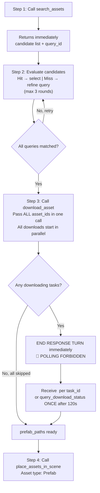

# Search & Download Unity Assets 🔍

Search the cloud asset library for Unity assets (prefab + dependencies) and download them to the project in parallel.

Pipeline: **search → evaluate → download → place_assets_in_scene skill**

1. `search_assets` returns a candidate list synchronously, along with a `query_id` (cache key)
2. AI evaluates candidates, retries with refined queries if needed (max 3 rounds)
3. `download_asset` accepts `query_id` and an `asset_ids` list, starts all downloads in parallel — **END response turn immediately**
4. Wait for `<bg_task_done>` notification per downloading task_id
5. Place the downloaded prefab(s) into the scene with `place_assets_in_scene`

## When NOT to Use

- User wants to generate a new 3D model from text/image → use `unity-3d-model-generation`
- User wants to generate a 2D sprite/icon → use `unity-sprite-generation`
- User wants to generate a skybox, audio, or material → use the corresponding generation skill

---

## ⚡ CRITICAL: Async Download — Notification-Driven, No Polling

- **Pass all asset_ids in a single `download_asset` call — downloads run in parallel internally.**
  - ❌ Do NOT call `download_asset` once per asset (serial calls)
  - ✅ Pass all selected `asset_id`s in one call: `asset_ids='["a","b","c"]'`
- **🚫 POLLING IS STRICTLY FORBIDDEN.** Never call `query_download_status` in a loop or more than once per task.
  - ❌ Do NOT call `query_download_status` repeatedly
  - ❌ Do NOT loop or sleep-wait for status
  - ✅ After `download_asset` returns, **END your response turn immediately**
  - ✅ A `<bg_task_done>` notification arrives **automatically** for each downloading task_id
  - ✅ Use `query_download_status` **at most once per task**, only as last-resort fallback after 120s with no notification
- `search_assets` is synchronous — returns results immediately including `query_id`, no task tracking needed
- Tasks with `status: "skipped"` already have `prefab_path` in the response — proceed immediately, no notification sent
- `AssetDatabase` is refreshed automatically after import

---

## **Recommended workflow:**



### Steps (single or batch)

1. **Search:** Call `search_assets`，Save the returned `query_id`.
   - Single asset: use `query` parameter.
   - Multiple assets: split the request into independent terms and use `queries` (JSON array) to submit all at once.
2. **Evaluate** candidates per query — max 3 rounds (original + 2 fallbacks):
   - Hit → mark as `selected`
   - Miss → refine query per the Query Rewrite Guide and retry; only re-query missed terms, not already-selected ones
   - After round 3 with no perfect match → pick the best overall candidate; never skip download due to "no match"
3. **Download:** Once all queries have a `selected`, call `download_asset` with all `asset_ids` in a single call.
   - If retries produced different `query_id`s, call `download_asset` once per `query_id` group (same message turn)
   - `skipped` tasks: `prefab_path` immediately available in response — proceed directly
   - `downloading` tasks: **END response turn** — do NOT poll
   - Wait for one `<bg_task_done>` notification per downloading `task_id`
   - Fallback: call `query_download_status` **ONCE** per task only if no notification within 120s
4. **Place:** Use the `prefab_path` from the notification (or `query_download_status` fallback) and call `place_assets_in_scene` with asset type `Prefab`.

---

## ⛔ MANDATORY TOOL CALL FORMAT

**Every `execute_custom_tool` call MUST pass `tool_name` as a direct top-level input field.**

The backend handler reads inputs as:
```
tool_name   → string (REQUIRED, top-level)
parameters  → object (optional, top-level)
```

**Correct JSON input structure:**
```json
{
  "tool_name": "search_assets",
  "parameters": {
    "query": "spaceship",
    "top_k": 5
  }
}
```

**NEVER nest `tool_name` inside `parameters`:**
```json
// ❌ WRONG — causes "tool_name is required" error
{ "parameters": { "tool_name": "search_assets", "query": "spaceship" } }

// ❌ WRONG — empty call, no tool_name
{}
```

When making a tool call, always verify the input object contains `"tool_name"` at the top level before submitting.

---

## Tools

All tools are called via `execute_custom_tool` using the format above.

### `search_assets`

Search the cloud asset library. **Returns synchronously** with a candidate list and a `query_id`. Supports single or batch queries.

```python
execute_custom_tool(
    tool_name="search_assets",
    parameters={
        "query": "spaceship",                         # single query (mutually exclusive with queries)
        # "queries": '["cat", "dog", "spaceship"]',   # batch queries (JSON array string)
        "top_k": 5,                                   # candidates per query, default 5
        # "filter_by_category": '["3d"]',              # optional: JSON array string, e.g. '["3d","animation"]'
    }
)
```

**Parameters:**

| Parameter | Type | Required | Description |
|-----------|------|----------|-------------|
| `query` | string | One of required | Single search term (mutually exclusive with `queries`) |
| `queries` | string (JSON array) | One of required | Batch search terms, e.g. `'["cat","chair","spaceship"]'` |
| `top_k` | int | No | Candidates per query (rerank top-K), default 5 |
| `filter_by_category` | string (JSON array) | No | Restrict results to one or more categories, e.g. `'["3d"]'` or `'["3d","animation"]'`; omit to search all categories |

**Single query response:**
```json
{
  "success": true,
  "query_id": "550e8400-e29b-41d4-a716-446655440000",
  "query": "spaceship",
  "top_k": 5,
  "results_count": 3,
  "results": [
    {
      "asset_id": "abc123",
      "prefab_path": "Assets/Vehicles/Spaceship.prefab",
      "url": "https://cdn.example.com/abc123.unitypackage",
      "name": "Sci-Fi Spaceship",
      "category": "vehicles",
      "source": "internal",
      "preview_url": "https://cdn.example.com/abc123/previews/abc123_overview.png",
      "keywords": ["spaceship", "sci-fi", "vehicle"],
      "score": 0.92,
      "description": "Sci-fi spaceship with blue metallic material"
    }
  ]
}
```

**Batch query response:**
```json
{
  "success": true,
  "query_id": "550e8400-e29b-41d4-a716-446655440000",
  "queries": ["cat", "spaceship"],
  "top_k": 5,
  "query_count": 2,
  "total_results_count": 6,
  "results": [
    {
      "query": "cat",
      "results_count": 3,
      "results": [{ "asset_id": "...", "prefab_path": "...", "url": "...", "name": "Cat", "score": 0.95 }]
    }
  ]
}
```

> **Note:** `description` and `keywords` are used for candidate evaluation (see "Candidate Evaluation Rules"); if absent, fall back to `score` and `prefab_path`/`name` only.

**Failure response:**
```json
{ "success": false, "message": "AUTH_REQUIRED: ..." }
```

---

### `download_asset`

Download one or more assets in a single call using the `query_id` from a previous `search_assets` call. **All downloads start in parallel immediately** and run in the background.

The prefab is moved to `Assets/TJGenerators/DownloadedAssets/{asset_id}/`. If that directory already exists, the asset is skipped (`status: "skipped"`) and the existing `prefab_path` is returned.

```python
execute_custom_tool(
    tool_name="download_asset",
    parameters={
        "query_id":  search_result["query_id"],              # required: from search_assets
        "asset_ids": '["abc123", "def456", "xyz789"]',       # required: JSON array of asset_id strings
    }
)
```

**Parameters:**

| Parameter | Type | Required | Description |
|-----------|------|----------|-------------|
| `query_id` | string | Yes | The `query_id` returned by `search_assets` |
| `asset_ids` | string (JSON array) | Yes | Asset IDs to download, e.g. `'["abc123","def456"]'` |

**Response:**
```json
{
  "success": true,
  "notification_mode": "bg_task_done",
  "async_task_count": 1,
  "tasks": [
    {
      "success": true,
      "task_id": "download_1_...",
      "status": "downloading",
      "notification_mode": "bg_task_done",
      "asset_id": "abc123",
      "name": "Cute Cat"
    },
    {
      "success": true,
      "task_id": "download_2_...",
      "status": "skipped",
      "asset_id": "xyz789",
      "name": "Spaceship",
      "prefab_path": "Assets/TJGenerators/DownloadedAssets/xyz789/Spaceship.prefab",
      "message": "Asset directory already exists..."
    }
  ],
  "message": "Started 1 async download(s). END THIS RESPONSE TURN immediately. ..."
}
```

> If an individual asset fails to start (asset_id not found in cache, etc.), its entry has `"success": false` with a `"message"` field. Other assets in the batch are unaffected.

---

### `<bg_task_done>` Notification (Primary)

When a `downloading` task completes or fails, a `<bg_task_done>` notification is automatically pushed to your next turn. `async_task_count` in the `download_asset` response tells you how many notifications to expect.

**Completed payload:**
```json
{
  "tool_name":        "download_asset",
  "task_id":          "download_1_...",
  "backend_task_id":  "abc123",
  "status":           "completed",
  "asset_id":         "abc123",
  "name":             "Cute Cat",
  "prefab_path":      "Assets/TJGenerators/DownloadedAssets/abc123/Cat.prefab",
  "metadata_path":    "Assets/TJGenerators/DownloadedAssets/abc123/abc123_metadata.json",
  "category":         "animals",
  "source":           "internal",
  "start_time":       "2024-12-13 10:30:00",
  "end_time":         "2024-12-13 10:30:45",
  "duration_seconds": 45
}
```

**Failed payload:**
```json
{
  "tool_name":        "download_asset",
  "task_id":          "download_1_...",
  "backend_task_id":  "abc123",
  "status":           "failed",
  "error":            "TIMEOUT: download exceeded 300s",
  "asset_id":         "abc123",
  "name":             "Cute Cat",
  "start_time":       "2024-12-13 10:30:00",
  "end_time":         "2024-12-13 10:35:00",
  "duration_seconds": 300
}
```

> `skipped` tasks do **not** send notifications — use `prefab_path` from the `download_asset` response directly.

**Fallback (120s timeout):** If no notification arrives within 120s, call `query_download_status` **exactly once** per task_id.

---

### `query_download_status`

⚠️ **ONE-TIME FALLBACK ONLY.** `download_asset` tasks push a `<bg_task_done>` notification automatically.
Only call this once per task_id if no notification arrives within **120 seconds**. **Never call it in a loop.**

Returns synchronously.

```python
execute_custom_tool(
    tool_name="query_download_status",
    parameters={"task_id": "download_1_..."}
)
```

**In-progress response:**
```json
{
  "success": true,
  "task_id": "download_1_...",
  "status": "downloading",
  "asset_id": "abc123",
  "name": "Cute Cat",
  "progress_percent": 0
}
```

**Importing response (`status: "importing"`):**
```json
{
  "success": true,
  "task_id": "download_1_...",
  "status": "importing",
  "asset_id": "abc123",
  "name": "Cute Cat",
  "progress_percent": 50
}
```

**Completed response:**
```json
{
  "success": true,
  "task_id": "download_1_...",
  "status": "completed",
  "asset_id": "abc123",
  "name": "Cute Cat",
  "progress_percent": 100,
  "prefab_path": "Assets/TJGenerators/DownloadedAssets/abc123/Cat.prefab",
  "metadata_path": "Assets/TJGenerators/DownloadedAssets/abc123/abc123_metadata.json",
  "imported_files": [
    "Assets/TJGenerators/DownloadedAssets/abc123/Cat.prefab",
    "Assets/Animals/Textures/Cat_Albedo.png"
  ],
  "duration_seconds": 5
}
```

**Skipped response:**
```json
{
  "success": true,
  "task_id": "download_1_...",
  "status": "skipped",
  "asset_id": "abc123",
  "name": "Cute Cat",
  "progress_percent": 100,
  "prefab_path": "Assets/TJGenerators/DownloadedAssets/abc123/Cat.prefab",
  "message": "Asset directory already exists...",
  "duration_seconds": 0
}
```

#### Status meanings

| Status | Meaning |
|--------|---------|
| `downloading` | Fetching `.unitypackage` from CDN (`progress_percent = 0`) |
| `importing` | Running `AssetDatabase.ImportPackage` and moving the prefab (`progress_percent = 50`) |
| `completed` | Unitypackage downloaded, imported, prefab moved; `AssetDatabase` refreshed (`progress_percent = 100`) |
| `skipped` | Asset directory already exists; use `prefab_path` directly (`progress_percent = 100`) |
| `failed` | Overall failure; see `error` field |
| `interrupted` | Domain reload killed the download — re-call `download_asset` with the same `query_id` + `asset_ids` (dedup is safe) |

`query_download_status` is a **ONE-TIME fallback only** — call at most once per task_id, 120s after `download_asset` if no `<bg_task_done>` notification arrives. **Polling in a loop is strictly forbidden.**

---

## Candidate Evaluation Rules

### When `description` / `keywords` are present

Evaluate each candidate using `description` + `keywords` + `score`:
- `score` ≥ 0.85 and description matches intent → **perfect hit**
- `score` ≥ 0.7 and asset type matches → **acceptable**, proceed to download
- `score` < 0.7 or asset type clearly wrong → **miss**, trigger fallback

### When `description` / `keywords` are absent

Skip semantic evaluation, use these rules directly:
- Pick the candidate with the highest `score` (or the first result if `score` is also absent)
- Use `prefab_path` filename/directory and `name` as secondary reference
- Proceed to download immediately — **do not trigger fallback retries** (insufficient signal)
- Note in the result: "Semantic evaluation skipped (description/keywords absent)"

---

## Query Rewrite Guide (for fallback retries on misses)

### Core goal

Rewriting is not about enriching the description — it's about **stripping modifiers layer by layer**, keeping the "asset type + core object" search skeleton. When the vector library lacks stylized assets, prioritize finding a **same-type** substitute.

### General rules

- Rewrite direction must be "narrowing", never "expanding" — do not add terms the user didn't mention.
- Keep asset type, purpose, and core object; progressively drop style, color, material, mood, and degree words.
- If still no hit after all rounds, prioritize "same asset type" — style/color differences are acceptable.
- Output must always be a concise search phrase — do not append type words like "prefab", "model", "package".

### Three-round fallback rules

1. **Round 1: original query**
   - Use the user's exact query; only strip conversational prefixes like "I want a" or "find me a".

2. **Round 2: drop weak modifiers, keep type and main object**
   - Remove: style words (pixel, cartoon, realistic, cyberpunk, Q-style), color words (red, green), weak descriptors (pretty, elegant, cute, cool)
   - Keep: asset type, purpose, main subject (obstacle, weapon, character, tree, building, spaceship)

3. **Round 3: keep only the core noun and asset type skeleton**
   - Strip remaining qualifiers; final query should ideally be just "core object + type" or the core object alone.
   - If the query is already very short, round 3 may be identical to round 2.

### Retention priority (high → low)

1. Asset type words: obstacle, terrain, weapon, vehicle, building, character, prop, plant, UI icon, etc.
2. Core object words: pipe, spaceship, tree, sword, door, chest, car, etc.
3. Function/purpose words: combat, decoration, platform, interactive, collectible, etc.
4. Strippable descriptors: style, color, material, mood, degree, detail adjectives

### Fallback examples

| Original query | Round 2 | Round 3 |
|----------------|---------|---------|
| pixel cartoon green pipe obstacle | green pipe obstacle | pipe obstacle |
| low-poly red treasure chest prop | red treasure chest | treasure chest |
| cyberpunk blue combat spaceship | blue combat spaceship | combat spaceship |

### Final selection rules (no perfect hit after round 3)

- After 3 query rounds, a final selection and download is mandatory — never abort due to "no match".
- Prefer candidates with the same asset type; within same type, compare how close the core object is.
- If no same-type candidate exists, pick the semantically closest with the highest `score` as a fallback.
- Style, color, and material are not grounds for final rejection.
- A "same-type, different style" asset is always better than a wrong-type asset.

### Prohibited actions

- Do not rewrite the original query to be longer or more elaborate.
- Do not introduce new objects, features, or style terms the user didn't mention.
- Do not reject a same-type candidate just because style or color doesn't match.
- Do not drop the "asset type word" early, leaving only vague adjectives.
- Do not fail to download after 3 query rounds due to "no match".

---

## Examples

### Batch parallel download and place in scene (recommended)

```python
import json

# Step 1: Batch search — one call, one query_id
result = execute_custom_tool(
    tool_name="search_assets",
    parameters={"queries": '["cat", "chair", "spaceship"]', "top_k": 5}
)
query_id = result["query_id"]

# → Evaluate candidates per query; assume we selected:
#   cat_selected, chair_selected, ship_selected (each has "asset_id")

# Step 2: Fire ALL downloads in one call — they run in parallel internally
dl = execute_custom_tool(
    tool_name="download_asset",
    parameters={
        "query_id":  query_id,
        "asset_ids": json.dumps([
            cat_selected["asset_id"],
            chair_selected["asset_id"],
            ship_selected["asset_id"],
        ]),
    }
)
# Collect immediately-available prefab paths (skipped tasks)
prefab_paths = {
    t["asset_id"]: t["prefab_path"]
    for t in dl["tasks"]
    if t.get("success") and t.get("status") == "skipped"
}

# Step 3: END RESPONSE TURN — wait for <bg_task_done> notifications
async_count = dl.get("async_task_count", 0)
if async_count > 0:
    # END RESPONSE TURN immediately — do NOT poll.
    # Each downloading task_id sends one <bg_task_done> notification on completion.
    # Notification payload: status, asset_id, prefab_path, metadata_path,
    #                        category, source, start_time, end_time, duration_seconds, error
    #
    # On notification status == "completed" → use prefab_path
    # On notification status == "failed":
    #   error contains "URL_EXPIRED"  → re-call search_assets, get new query_id, retry
    #   error contains "interrupted"  → retry download_asset with same query_id + asset_ids
    #
    # ONE-TIME fallback (only if no notification within 120s per task):
    # status = execute_custom_tool(tool_name="query_download_status",
    #                              parameters={"task_id": tid})
    pass
# If async_count == 0: all tasks were skipped → proceed directly to Step 4

# Step 4: Place each prefab into the scene via place_assets_in_scene skill
```

---

## Constraints

Use `place_assets_in_scene` to place downloaded `prefab_path` assets into the scene with asset type `Prefab`. Default to this skill for placement; do not write `.cs` files to disk unless the user explicitly asks. `execute_csharp_script` is only for non-placement supplementary scene operations.

- Do not introduce new core requirement terms the user didn't mention.
- When `download_asset` returns a task with `success: false`, the `message` field describes the cause — report it to the user.
- Always pass all asset_ids in a **single** `download_asset` call per `query_id`, never multiple serial calls.
- If `description`/`keywords` are absent, skip semantic evaluation, select the highest-score candidate, and do not trigger fallback retries.
- Download URLs are cached server-side and **signed / short-lived**. If a task fails with `URL_EXPIRED`, re-call `search_assets` with the same query to get a fresh `query_id` with fresh URLs — never reuse a `query_id` from a prior search call after expiry.

---

## Troubleshooting

| Problem | Solution |
|---------|---------|
| `AUTH_REQUIRED` | Sign in via Unity Hub or the Unity Editor account panel, then retry |
| `search_assets` returns empty results | Simplify the query (drop modifiers), or use a more generic term |
| `download_asset` task `success: false` | Check `message`; if "not found in query results", verify the `asset_id` was in the `search_assets` response; if "expired or not found", re-call `search_assets` to get a new `query_id` |
| `status: interrupted` or notification `error` contains `"interrupted"` | Domain reload killed the download — re-call `download_asset` with the same `query_id` + `asset_ids` (dedup keeps it idempotent) |
| No `<bg_task_done>` notification within 120s | Call `query_download_status` **ONCE** per task_id as fallback; do NOT loop |
| `status: skipped` | Destination directory already existed — use the returned `prefab_path` directly |
| `status: failed` with `URL_EXPIRED` | Re-call `search_assets` with the same query to get a fresh `query_id`, then retry immediately |
| `status: failed` | Read the `error` field; common causes: `TIMEOUT`, `PARSE_ERROR`, `ImportPackage failed`, `MoveAsset failed` |
| Download complete but Unity doesn't see the asset | `AssetDatabase` refresh is automatic; if still missing, run `Assets → Refresh` manually |
